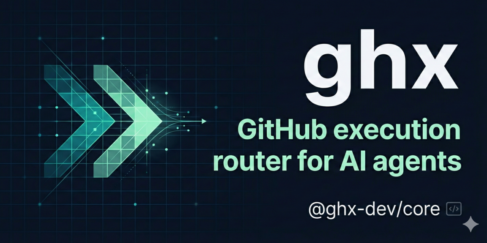
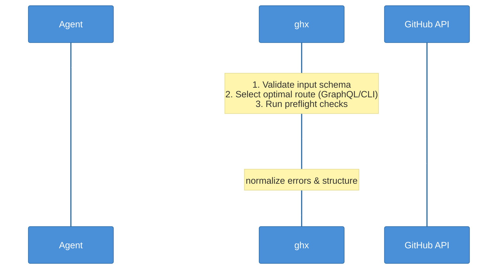

# ghx

<p align="center">
  
</p>

> GitHub execution router for AI agents.
> One typed capability interface over `gh` CLI + GraphQL.



[](https://github.com/aryeko/ghx/actions/workflows/ci-main.yml)
[](https://codecov.io/gh/aryeko/ghx)
[](https://www.npmjs.com/package/@ghx-dev/core)
[](https://opensource.org/licenses/MIT)

`ghx` helps agents execute GitHub tasks without re-discovering API surfaces on every run. Agents call stable capabilities like `repo.view` or `pr.merge`; ghx handles route choice, retries, fallbacks, and normalized output.

## 30-Second Quick Start

Requirements: Node.js `22+`, `gh` CLI authenticated, `GITHUB_TOKEN` or `GH_TOKEN` in env.

```bash
npm i -g @ghx-dev/core
ghx capabilities list
ghx capabilities explain repo.view
ghx run repo.view --input '{"owner":"aryeko","name":"ghx"}'
```

Then wire ghx into your agent:

```bash
# Claude Code — install from the plugin marketplace
claude plugin add ghx

# Cursor, Windsurf, Codex, other agents — install the skill
ghx setup --scope user --yes
```

<details>
<summary>Try without installing (npx)</summary>

```bash
npx @ghx-dev/core capabilities list
npx @ghx-dev/core run repo.view --input '{"owner":"aryeko","name":"ghx"}'
```

</details>

## Who is this for?

- **Claude Code users** -- install from the plugin marketplace (`claude plugin add ghx`) for automatic skill loading
- **Cursor / Windsurf / Codex users** -- install globally and run `ghx setup --scope user` to get the agent skill
- **Custom agent builders** -- import `createExecuteTool()` for typed GitHub access in your own agent framework

## The Problem

Agents instructed to "use `gh` CLI" for GitHub operations waste significant tokens on research, trial-and-error, and output parsing:

- **Array parameter syntax is fragile.** Submitting a PR review with inline comments via `gh api` requires `comments[0][path]`, `comments[][body]`, or heredoc piping. Agents try 3-15 syntaxes before one works.
- **API surface re-discovery every session.** Each new session, the agent figures out which `gh` subcommands exist, what `--json` fields are available, and how to format GraphQL queries from scratch.
- **Output shapes vary by endpoint.** REST, GraphQL, and `gh` CLI each return different structures. The agent spends tokens parsing and normalizing before it can reason about results.

## Before / After

**WITHOUT ghx** -- agent submitting a PR review with inline comments (15 tool calls, 126s):

```bash
gh pr view 42 --repo acme/repo                          # read PR
gh pr diff 42 --repo acme/repo                          # read diff
gh api POST reviews -f event=REQUEST_CHANGES \           # attempt 1: 422 error
  -f 'comments[0][path]=src/stats.ts' ...
noglob gh api POST reviews ...                           # attempt 2: 422 error
python3 -c "import json; ..." | gh api --input -         # attempt 3: no inline comments
gh api POST reviews/comments -f path=src/stats.ts ...    # attempt 4-6: individual comments
gh api POST reviews -f event=REQUEST_CHANGES             # attempt 7: submit event
gh pr view 42 --json reviews                             # verify
```

**WITH ghx** -- same task (2 tool calls, 26s):

```bash
ghx chain --steps - <<'EOF'
[
  {"task":"pr.diff.view","input":{"owner":"acme","name":"repo","prNumber":42}},
  {"task":"pr.view","input":{"owner":"acme","name":"repo","prNumber":42}}
]
EOF
ghx run pr.reviews.submit --input - <<'EOF'
{
  "owner": "acme", "name": "repo", "prNumber": 42,
  "event": "REQUEST_CHANGES",
  "body": "Found blocking issues.",
  "comments": [
    {"path": "src/stats.ts", "line": 4, "body": "Empty array guard missing."},
    {"path": "src/stats.ts", "line": 8, "body": "Missing await on fetch."},
    {"path": "src/stats.ts", "line": 12, "body": "Hardcoded credential."}
  ]
}
EOF
```

## Benchmarked Performance

Three-mode comparison (baseline vs MCP vs ghx) across 30 runs (2 scenarios, 5 iterations each, 3 modes) with Codex 5.3. ghx achieved 100% success rate.

| Scenario | Tool calls | Active tokens | Latency |
| --- | --- | --- | --- |
| Reply to unresolved review threads | **-73%** | **-18%** | **-54%** |
| Review and comment on PR | **-71%** | **-18%** | **-54%** |

Full methodology, per-iteration data, and statistical analysis: [Evaluation Report](docs/eval-report.md)

## Chain: Batch Operations

`ghx chain` batches multiple operations into a single tool call. One command, batched execution, three operations:

```bash
ghx chain --steps - <<'EOF'
[
  {"task":"issue.labels.remove","input":{"owner":"acme","name":"repo","issueNumber":42,"labels":["triage","feature-request"]}},
  {"task":"issue.labels.add","input":{"owner":"acme","name":"repo","issueNumber":42,"labels":["enhancement"]}},
  {"task":"issue.comments.create","input":{"owner":"acme","name":"repo","issueNumber":42,"body":"Triaged -- tracking as enhancement."}}
]
EOF
```

Agents use chain to collapse multi-step workflows (label swap + comment, bulk thread resolve + reply, etc.) into a single tool call instead of sequential shell commands.

## Example Output

```json
{
  "ok": true,
  "data": {
    "id": "...",
    "name": "ghx",
    "nameWithOwner": "aryeko/ghx"
  },
  "error": null,
  "meta": {
    "capability_id": "repo.view",
    "route_used": "cli",
    "reason": "CARD_PREFERRED"
  }
}
```

## Golden Workflow: CI Diagnosis

Diagnose a failing CI run, read logs, rerun, and merge:

```bash
ghx run workflow.run.view --input '{"owner":"acme","name":"repo","runId":123456}'
ghx run workflow.job.logs.view --input '{"owner":"acme","name":"repo","jobId":789012}'
ghx run workflow.run.rerun.failed --input '{"owner":"acme","name":"repo","runId":123456}'
ghx run pr.checks.list --input '{"owner":"acme","name":"repo","prNumber":14}'
ghx run pr.merge --input '{"owner":"acme","name":"repo","prNumber":14,"method":"squash"}'
```

## Capabilities

70+ capabilities across 6 domains ([full list](packages/core/docs/reference/capabilities.md)).

## Security and Permissions

- Use least-privilege tokens and only grant scopes needed for the capabilities you execute.
- For fast local evaluation, a classic PAT with `repo` scope is the simplest path.
- For production agents, prefer fine-grained tokens with read permissions first (`Metadata`, `Contents`, `Pull requests`, `Issues`, `Actions`, `Projects`) and add write permissions only where required.
- `ghx` reads `GITHUB_TOKEN` or `GH_TOKEN` from environment.

## Packages

- `@ghx-dev/core` (`packages/core`) -- public npm package; CLI + execution engine
- `@ghx-dev/agent-profiler` (`packages/agent-profiler`) -- private; generic AI agent session profiler
- `@ghx-dev/eval` (`packages/eval`) -- private; evaluation harness for ghx benchmarking

## Documentation

Full documentation lives in [`docs/`](docs/README.md):

- **[Core Documentation](packages/core/docs/README.md)** -- Getting started, architecture, capabilities, guides
- **[Agent Profiler](packages/agent-profiler/docs/README.md)** -- Profiler architecture, guides, API reference
- **[Eval Harness](packages/eval/docs/README.md)** -- Evaluation methodology, scenarios, fixtures
- **[Contributing](CONTRIBUTING.md)** -- Development setup, testing, CI, publishing
- **[Repository Structure](docs/repository-structure.md)** -- Monorepo layout and module organization
- Branding assets: `assets/branding/README.md`

## Background

Read the full motivation and benchmark methodology: [AI Agents Shouldn't Relearn GitHub on Every Run](https://plainenglish.io/artificial-intelligence/ai-agents-shouldn-t-relearn-github-on-every-run)

## Roadmap

Current roadmap priorities and capability batches are tracked in `ROADMAP.md`.

## Contributing

See `CONTRIBUTING.md` for local setup, test commands, and PR expectations.

Tooling notes for local development:

- `gh` CLI is required for CLI-backed execution paths (`gh auth status`).
- `opencode` CLI is only required if you run E2E suites locally (`pnpm run test:e2e`); CI installs it via `curl -fsSL https://opencode.ai/install | bash`.

```bash
git clone https://github.com/aryeko/ghx.git && cd ghx
./scripts/setup-dev-env.sh
pnpm install
pnpm run build
pnpm run ci
```

Questions? Open a [Discussion](https://github.com/aryeko/ghx/discussions).

## License

MIT © Arye Kogan
