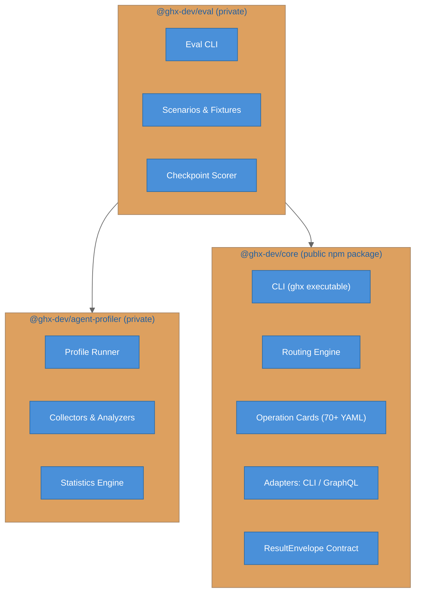

# Architecture

ghx is a GitHub execution router for AI agents. It provides a typed capability interface over the `gh` CLI and GitHub GraphQL API, giving agents deterministic, token-efficient access to GitHub operations.

## Package Structure



### @ghx-dev/core

The product. A CLI and library that routes agent requests to GitHub through the optimal execution path (GraphQL or CLI). Agents call typed capabilities like `pr.view` or `issue.create`; the routing engine validates input against operation card schemas, selects the best route, handles retries and fallbacks, and returns a normalized `ResultEnvelope { ok, data, error, meta }`.

### @ghx-dev/agent-profiler

A generic framework for profiling AI agent sessions. Measures latency, tokens, tool calls, cost, and behavioral patterns. Provides 6 plugin contracts (SessionProvider, Scorer, Collector, Analyzer, ModeResolver, RunHooks) that consumers implement for their specific agent and evaluation setup. Not specific to ghx -- can profile any agent workflow.

### @ghx-dev/eval

The ghx-specific evaluation harness. Implements the agent-profiler plugin contracts to benchmark ghx routing against raw `gh` CLI and GitHub MCP server tools. Runs identical tasks across modes with fixture seeding, checkpoint-based scoring, and statistical analysis (bootstrap CIs, Cohen's d, permutation tests).

## Core Execution Flow

```text
Agent --> CLI (ghx run / ghx chain)
      --> executeTask() [routing/engine.ts]
      --> validate input (AJV + operation card schema)
      --> evaluate suitability rules
      --> select route [preferred, ...fallbacks]
      --> preflight check (GITHUB_TOKEN, gh auth)
      --> adapter execution (CLI or GraphQL)
      --> normalize response
      --> ResultEnvelope { ok, data, error, meta }
```

For a detailed walkthrough of route selection, suitability rules, retries, and fallbacks, see [Routing Engine](../packages/core/docs/concepts/routing-engine.md).

## Further Reading

- [Repository Structure](repository-structure.md) -- detailed file layout and module organization
- [Core Documentation](../packages/core/docs/README.md) -- getting started, concepts, architecture, reference
- [Agent Profiler Documentation](../packages/agent-profiler/docs/README.md) -- profiler architecture and guides
- [Eval Documentation](../packages/eval/docs/README.md) -- evaluation methodology and scenarios
