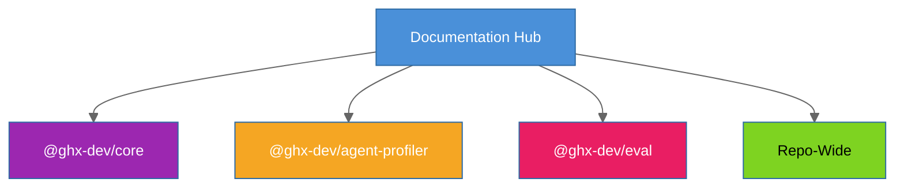

# ghx Documentation

ghx is a GitHub execution router for AI agents -- one typed capability interface over `gh` CLI and GraphQL. It validates input, selects the optimal route, handles retries, and returns a stable `ResultEnvelope`.

> **Start here:** [Root README](../README.md) for quick start and overview, or [Core Getting Started](../packages/core/docs/getting-started/README.md) for detailed setup.

## Packages

| Package | Description | Docs |
|---------|-------------|------|
| `@ghx-dev/core` | Public npm package -- CLI + capability routing engine | [packages/core/docs/](../packages/core/docs/README.md) |
| `@ghx-dev/agent-profiler` | Generic AI agent session profiler | [packages/agent-profiler/docs/](../packages/agent-profiler/docs/README.md) |
| `@ghx-dev/eval` | Evaluation harness for ghx benchmarking | [packages/eval/docs/](../packages/eval/docs/README.md) |

## Repo-Wide Documentation

- [Evaluation Report](eval-report.md) -- Empirical evaluation, statistical analysis, and bundled raw data
- [Repository Structure](repository-structure.md) -- Monorepo layout and module organization
- [Architecture](ARCHITECTURE.md) -- Package structure, execution flow, and design overview
- [Troubleshooting](TROUBLESHOOTING.md) -- Common setup, runtime, and CI issues with fixes
- [Contributing](../CONTRIBUTING.md) -- Development setup, testing, CI, publishing
- [Roadmap](../ROADMAP.md) -- Current priorities and capability batches
- [Blog Post: AI Agents Shouldn't Relearn GitHub on Every Run](https://plainenglish.io/artificial-intelligence/ai-agents-shouldn-t-relearn-github-on-every-run) -- Full motivation and benchmark methodology
