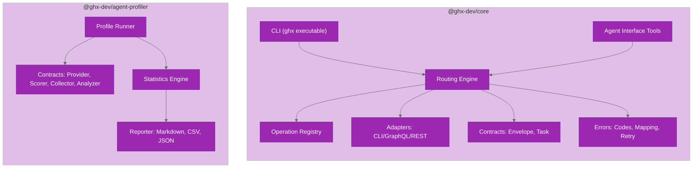

# Repository Structure

This document provides a comprehensive overview of the ghx repository layout, module organization, and key files.

## Workspace Structure

`ghx` is an Nx + pnpm monorepo with two packages plus supporting tooling:

```text
ghx/
├── .changeset/                  # Changesets for versioning
├── .claude-plugin/              # Claude Code marketplace manifest
├── .github/
│   ├── dependabot.yml          # Automated dependency updates
│   └── workflows/              # CI/CD workflows
├── docs/
│   ├── architecture/           # Architecture documentation (this section)
│   ├── benchmark/              # Benchmark methodology & reporting
│   ├── capabilities/           # Per-domain capability reference
│   ├── contributing/           # Development setup, testing, CI, publishing
│   ├── getting-started/        # Installation, first task, agent setup
│   ├── guides/                 # CLI usage, library API, error handling
│   └── plans/                  # Design docs and implementation plans
├── packages/
│   ├── core/                   # @ghx-dev/core (public npm package)
│   │   ├── .claude-plugin/     # Claude Code plugin manifest
│   │   ├── skills/             # Agent skill templates (also used by plugin)
│   │   │   └── using-ghx/      # ghx usage skill (SKILL.md)
│   │   ├── src/
│   │   │   ├── cli/                  # ghx CLI entrypoint
│   │   │   ├── core/                 # Core runtime
│   │   │   │   ├── contracts/        # Stable envelope & task contracts
│   │   │   │   ├── errors/           # Error taxonomy & mapping
│   │   │   │   ├── execute/          # Execution orchestration
│   │   │   │   ├── execution/        # Adapters & normalizer
│   │   │   │   ├── registry/         # Operation card registry
│   │   │   │   ├── routing/          # Route planning & engine
│   │   │   │   └── telemetry/        # Structured logging
│   │   │   ├── gql/                  # GraphQL client & operations
│   │   │   └── shared/               # Shared utilities
│   │   ├── scripts/            # Build-time scripts
│   │   ├── test/               # Tests
│   │   └── tsup.config.ts      # Build config
│   └── agent-profiler/          # @ghx-dev/agent-profiler (private)
│       ├── src/
│       │   ├── analyzer/       # Built-in analyzers (5)
│       │   ├── collector/      # Built-in collectors (4)
│       │   ├── config/         # Config schema & YAML loader
│       │   ├── contracts/      # Plugin contracts (6)
│       │   ├── reporter/       # Report generation (Markdown, CSV, JSON)
│       │   ├── runner/         # Profile runner & iteration lifecycle
│       │   ├── shared/         # Logger & constants
│       │   ├── stats/          # Statistics engine (descriptive, bootstrap, comparison)
│       │   ├── store/          # JSONL store & run manifests
│       │   └── types/          # Core type definitions
│       ├── docs/               # Package documentation
│       ├── test/               # Tests (unit + integration)
│       └── tsup.config.ts      # Build config
├── nx.json                     # Nx configuration
├── package.json                # Root package and workspace scripts
├── pnpm-workspace.yaml         # Workspace definition
├── biome.json                  # Biome formatter config
├── lefthook.yml                # Pre-commit hooks
├── .npmrc                      # pnpm configuration
└── CLAUDE.md                   # Claude Code guidance
```

## Core Package Modules

`packages/core/src` is organized into logical modules:

### Contracts & Errors (`core/contracts`, `core/errors`)

**Purpose**: Define stable contracts and error taxonomy.

| Module | Purpose | Key Exports |
|--------|---------|-------------|
| `core/contracts/envelope.ts` | Result envelope contract | `ResultEnvelope`, `RouteSource` |
| `core/contracts/task.ts` | Input task contract | `TaskRequest` |
| `core/errors/codes.ts` | Error code taxonomy | `errorCodes`, `ErrorCode` |
| `core/errors/map-error.ts` | Error classification | `mapErrorToCode()` |
| `core/errors/retryability.ts` | Retry policy by code | `isRetryableErrorCode()` |

### Registry (`core/registry`)

**Purpose**: Load, validate, and lookup operation cards.

| Module | Purpose | Key Exports |
|--------|---------|-------------|
| `core/registry/index.ts` | Card loader & lookup | `validateOperationCard()`, `listOperationCards()`, `getOperationCard()` |
| `core/registry/types.ts` | Card and routing types | `OperationCard`, `SuitabilityRule` |
| `core/registry/schema-validator.ts` | JSON schema validation | `validateInput()`, `validateOutput()` |
| `core/registry/schema-utils.ts` | Schema helper utilities | JSON schema helpers |
| `core/registry/operation-card-schema.ts` | Card schema definition | `operationCardSchema` |
| `core/registry/ajv-instance.ts` | Shared AJV instance | `ajv` |
| `core/registry/cards/*.yaml` | Capability definitions | 70 operation cards |

### Routing Engine (`core/routing`)

**Purpose**: Plan routes and select preferred execution paths.

| Module | Purpose | Key Exports |
|--------|---------|-------------|
| `core/routing/engine.ts` | Main task coordinator | `executeTask()` |
| `core/routing/policy.ts` | Route preference ordering | `routePreferenceOrder` |
| `core/routing/reason-codes.ts` | Route reason taxonomy | `routeReasonCodes`, `RouteReasonCode` |
| `core/routing/capability-registry.ts` | Registry view for routing | `capabilityRegistry` |

### Execution Pipeline (`core/execute`, `core/execution`)

**Purpose**: Validate, execute, retry, and normalize.

| Module | Purpose | Key Exports |
|--------|---------|-------------|
| `core/execute/execute.ts` | Route planning & retry loop | `execute()` |
| `core/execution/preflight.ts` | Route readiness checks | `preflightCheck()` |
| `core/execution/normalizer.ts` | Output normalization | `normalizeResult()`, `normalizeError()` |
| `core/execution/adapters/cli-capability-adapter.ts` | CLI capability adapter | `runCliCapability()`, `CliCapabilityId` |
| `core/execution/adapters/cli/capability-registry.ts` | CLI handler registry | `getCliHandler()`, `listCliCapabilities()` |
| `core/execution/adapters/cli/helpers.ts` | Shared CLI arg-building helpers | `buildRepoArg()`, `buildPaginationArgs()`, etc. |
| `core/execution/adapters/cli/domains/repo.ts` | Repo-domain CLI handlers | `repo.view`, `repo.labels.list`, `repo.issue_types.list` |
| `core/execution/adapters/cli/domains/issue.ts` | Issue-domain CLI handlers | `issue.view`, `issue.list`, `issue.comments.list` |
| `core/execution/adapters/cli/domains/pr.ts` | PR-domain CLI handlers | `pr.*` capabilities |
| `core/execution/adapters/cli/domains/workflow.ts` | Workflow-domain CLI handlers | `workflow.*` capabilities |
| `core/execution/adapters/cli/domains/project-v2.ts` | Project V2-domain CLI handlers | `project_v2.*` capabilities |
| `core/execution/adapters/cli/domains/release.ts` | Release-domain CLI handlers | `release.*` capabilities |
| `core/execution/adapters/graphql-capability-adapter.ts` | GraphQL capability adapter | `runGraphqlCapability()` |
| `core/execution/adapters/cli-adapter.ts` | Generic CLI wrapper | `runCliAdapter()` |
| `core/execution/adapters/graphql-adapter.ts` | Generic GraphQL wrapper | `runGraphqlAdapter()` |
| `core/execution/adapters/rest-adapter.ts` | REST stub | `runRestAdapter()` |
| `core/execution/cli/safe-runner.ts` | Safe CLI spawn wrapper | `createSafeCliCommandRunner()` |

### Telemetry (`core/telemetry`)

**Purpose**: Structured logging with redaction.

| Module | Purpose | Key Exports |
|--------|---------|-------------|
| `core/telemetry/logger.ts` | Event emitter | `logger.emit()` |

### GraphQL Client (`gql`)

**Purpose**: Typed GitHub GraphQL facade.

| Module | Purpose | Key Exports |
|--------|---------|-------------|
| `gql/transport.ts` | GraphQL transport and low-level client | `createGraphqlClient()`, `createTokenTransport()` |
| `gql/github-client.ts` | Lazy-loaded GitHub GraphQL facade | `createGithubClient()`, `createGithubClientFromToken()` |
| `gql/capability-registry.ts` | GQL handler registry by capability ID | `GraphqlHandler` map |
| `gql/types.ts` | GQL input/output contracts | GraphQL domain input/data types |
| `gql/assertions.ts` | GraphQL input validation helpers | `assert*` validation utilities |
| `gql/document-registry.ts` | Lookup & mutation document registry | `getLookupDocument()`, `getMutationDocument()` |
| `gql/resolve.ts` | Resolution inject helpers | `applyInject()`, `buildMutationVars()` |
| `gql/batch.ts` | Batch query/mutation builder | `buildBatchQuery()`, `buildBatchMutation()` |
| `gql/builders.ts` | Per-capability mutation builders | `OPERATION_BUILDERS` |
| `gql/domains/*.ts` | Domain operation modules | `run*` operation handlers |
| `gql/operations/*.generated.ts` | Generated operation SDKs | Operation-specific `getSdk()` |
| `gql/generated/common-types.generated.ts` | Generated scalar types | Type aliases |

### CLI & Agent Interface

**Purpose**: User entrypoints and agent tool surface.

| Module | Purpose | Key Exports |
|--------|---------|-------------|
| `cli/index.ts` | CLI command router | `main()` |
| `cli/commands/run.ts` | Task parsing & execution | `runCommand()` |
| `cli/commands/setup.ts` | Skill installation | `setupCommand()` |
| `cli/commands/capabilities-list.ts` | List capabilities | `capabilitiesListCommand()` |
| `cli/commands/capabilities-explain.ts` | Explain capability | `capabilitiesExplainCommand()` |
| `skills/using-ghx/SKILL.md` (package root) | Setup skill template / Claude Code plugin skill | (markdown) |
| `core/execute/execute-tool.ts` | Execute wrapper | `createExecuteTool()` |
| `core/registry/list-capabilities.ts` | List tool | `listCapabilities()` |
| `core/registry/explain-capability.ts` | Explain tool | `explainCapability()` |

### Package Entrypoints

| File | Purpose |
|------|---------|
| `index.ts` | Public npm package API |

## Agent Profiler Package Modules

`packages/agent-profiler/src` is organized by concern:

### Contracts (`contracts`)

| Module | Purpose | Key Exports |
|--------|---------|-------------|
| `contracts/provider.ts` | Session provider contract | `SessionProvider`, `ProviderConfig`, `PromptResult` |
| `contracts/scorer.ts` | Scoring contract | `Scorer`, `ScorerResult`, `ScorerContext` |
| `contracts/collector.ts` | Metric collector contract | `Collector` |
| `contracts/analyzer.ts` | Trace analyzer contract | `Analyzer` |
| `contracts/mode-resolver.ts` | Mode resolution contract | `ModeResolver`, `ModeConfig` |
| `contracts/hooks.ts` | Lifecycle hooks | `RunHooks`, `BeforeScenarioContext`, `AfterScenarioContext` |

### Runner (`runner`)

| Module | Purpose | Key Exports |
|--------|---------|-------------|
| `runner/profile-runner.ts` | Suite orchestrator | `runProfileSuite()`, `ProfileSuiteOptions` |
| `runner/iteration.ts` | Single iteration executor | `runIteration()` |
| `runner/warmup.ts` | Warmup canary | `runWarmup()` |

### Collectors & Analyzers (`collector`, `analyzer`)

| Module | Purpose | Key Exports |
|--------|---------|-------------|
| `collector/token-collector.ts` | Token usage metrics | `TokenCollector` |
| `collector/latency-collector.ts` | Latency metrics | `LatencyCollector` |
| `collector/cost-collector.ts` | Cost metrics | `CostCollector` |
| `collector/tool-call-collector.ts` | Tool call metrics | `ToolCallCollector` |
| `analyzer/reasoning-analyzer.ts` | Reasoning analysis | `reasoningAnalyzer` |
| `analyzer/strategy-analyzer.ts` | Strategy classification | `strategyAnalyzer` |
| `analyzer/efficiency-analyzer.ts` | Efficiency measurement | `efficiencyAnalyzer` |
| `analyzer/tool-pattern-analyzer.ts` | Tool pattern detection | `toolPatternAnalyzer` |
| `analyzer/error-analyzer.ts` | Error categorization | `errorAnalyzer` |

### Statistics & Reporting (`stats`, `reporter`, `store`)

| Module | Purpose | Key Exports |
|--------|---------|-------------|
| `stats/descriptive.ts` | Descriptive statistics | `computeDescriptive()` |
| `stats/bootstrap.ts` | Bootstrap CIs | `bootstrapCI()`, `bootstrapReductionCI()` |
| `stats/comparison.ts` | Group comparison | `compareGroups()`, `cohensD()`, `permutationTest()` |
| `reporter/orchestrator.ts` | Report generation | `generateReport()` |
| `store/jsonl-store.ts` | JSONL storage | `appendJsonlLine()`, `readJsonlFile()` |
| `store/run-manifest.ts` | Run manifests | `readManifest()`, `writeManifest()` |

### Configuration (`config`)

| Module | Purpose | Key Exports |
|--------|---------|-------------|
| `config/schema.ts` | Zod config validation | `ProfilerConfigSchema`, `ProfilerConfig` |
| `config/loader.ts` | YAML config loading | `loadConfig()`, `parseProfilerFlags()` |

## Key Files by Concern

### Workspace + Build System

- `package.json` - root scripts for build/format/lint/test/typecheck/benchmark
- `pnpm-workspace.yaml` - workspace discovery + pnpm catalog
- `nx.json` - Nx task orchestration
- `biome.json` - Biome formatter (2-space indent, 100-char width)
- `lefthook.yml` - pre-commit hooks (format, lint, typecheck)
- `.npmrc` - pnpm settings
- `.github/dependabot.yml` - dependency update automation

### Core Router Execution

- `packages/core/src/core/routing/engine.ts` - **route selection + preflight**
- `packages/core/src/core/execute/execute.ts` - **route attempts, retry, validation**
- `packages/core/src/core/execution/adapters/cli-capability-adapter.ts` - CLI mapping
- `packages/core/src/core/execution/adapters/graphql-capability-adapter.ts` - GraphQL mapping
- `packages/core/src/core/registry/cards/*.yaml` - **capability definitions**

### Error Handling

- `packages/core/src/core/errors/codes.ts` - **error code list**
- `packages/core/src/core/errors/map-error.ts` - **error classification**
- `packages/core/src/core/errors/retryability.ts` - retry policy

### CLI User Interaction

- `packages/core/src/cli/index.ts` - `ghx` executable
- `packages/core/src/cli/commands/run.ts` - task parsing
- `packages/core/src/cli/commands/setup.ts` - skill installation

### Agent Tools

- `packages/core/src/core/execute/execute-tool.ts` - execute wrapper
- `packages/core/src/core/registry/list-capabilities.ts` - list tool
- `packages/core/src/core/registry/explain-capability.ts` - explain tool

### Agent Profiler

- `packages/agent-profiler/src/runner/profile-runner.ts` - **suite orchestration**
- `packages/agent-profiler/src/runner/iteration.ts` - single iteration executor
- `packages/agent-profiler/src/stats/comparison.ts` - cross-mode comparison
- `packages/agent-profiler/src/reporter/orchestrator.ts` - report generation

### Tests

- `packages/core/test/unit/*.test.ts` - unit tests
- `packages/core/test/integration/*.integration.test.ts` - integration tests
- `packages/agent-profiler/test/unit/*.test.ts` - profiler unit tests
- `packages/agent-profiler/test/integration/*.integration.test.ts` - profiler integration tests

## Package Boundaries



## Navigation Shortcuts

Use these paths when debugging common concerns:

| Concern | Starting File |
|---------|---------------|
| Route selection issue | `packages/core/src/core/routing/engine.ts` |
| Input/output validation | `packages/core/src/core/execute/execute.ts` + `packages/core/src/core/registry/schema-validator.ts` |
| Capability metadata | `packages/core/src/core/registry/cards/*.yaml` |
| CLI command shape | `packages/core/src/core/execution/adapters/cli-capability-adapter.ts` |
| GraphQL field mismatch | `packages/core/src/gql/domains/*.ts` + `packages/core/src/gql/operations/*.generated.ts` |
| Profiler suite configuration | `packages/agent-profiler/src/config/schema.ts` |
| Profiler iteration failure | `packages/agent-profiler/src/runner/iteration.ts` |
| Report generation | `packages/agent-profiler/src/reporter/orchestrator.ts` |

## Suggested Reading Paths

### New Contributor

1. [docs/architecture/system-design.md](system-design.md) — understand design goals
2. [docs/architecture/repository-structure.md](repository-structure.md) (this file) — map the codebase
3. [docs/architecture/routing-engine.md](routing-engine.md) — understand route selection
4. [docs/architecture/operation-cards.md](operation-cards.md) — understand capabilities

### Router Internals

1. [docs/architecture/routing-engine.md](routing-engine.md) — route planning
2. [packages/core/src/core/routing/engine.ts](../../packages/core/src/core/routing/engine.ts) — implementation
3. [docs/architecture/adapters.md](adapters.md) — adapter execution
4. [docs/guides/error-handling.md](../guides/error-handling.md) — error handling

### Adding a Capability

1. [docs/architecture/operation-cards.md](operation-cards.md) — card structure
2. [packages/core/src/core/registry/cards/](../../packages/core/src/core/registry/cards/) — examples
3. [docs/architecture/adapters.md](adapters.md) — adapter support
4. [docs/architecture/routing-engine.md](routing-engine.md) — routing policy

### Agent Profiler Internals

1. [packages/agent-profiler/docs/architecture/overview.md](../../packages/agent-profiler/docs/architecture/overview.md)
2. [packages/agent-profiler/src/runner/profile-runner.ts](../../packages/agent-profiler/src/runner/profile-runner.ts)
3. [packages/agent-profiler/docs/architecture/statistics.md](../../packages/agent-profiler/docs/architecture/statistics.md)

## External Integration Points

- **GitHub GraphQL API** — `packages/core/src/gql/github-client.ts`
- **GitHub CLI (`gh`)** — `packages/core/src/core/execution/adapters/cli-capability-adapter.ts`
- **JSON Schema Validation (AJV)** — `packages/core/src/core/registry/`
- **Config Validation (Zod)** — `packages/agent-profiler/src/config/schema.ts`

## Related Documentation

- [docs/architecture/](.) — All architecture docs
- [packages/agent-profiler/docs/](../../packages/agent-profiler/docs/) — Agent profiler documentation
- [docs/guides/](../guides/) — CLI usage, library API, agent integration, error handling
- [docs/contributing/](../contributing/) — Development setup, testing, CI, publishing
