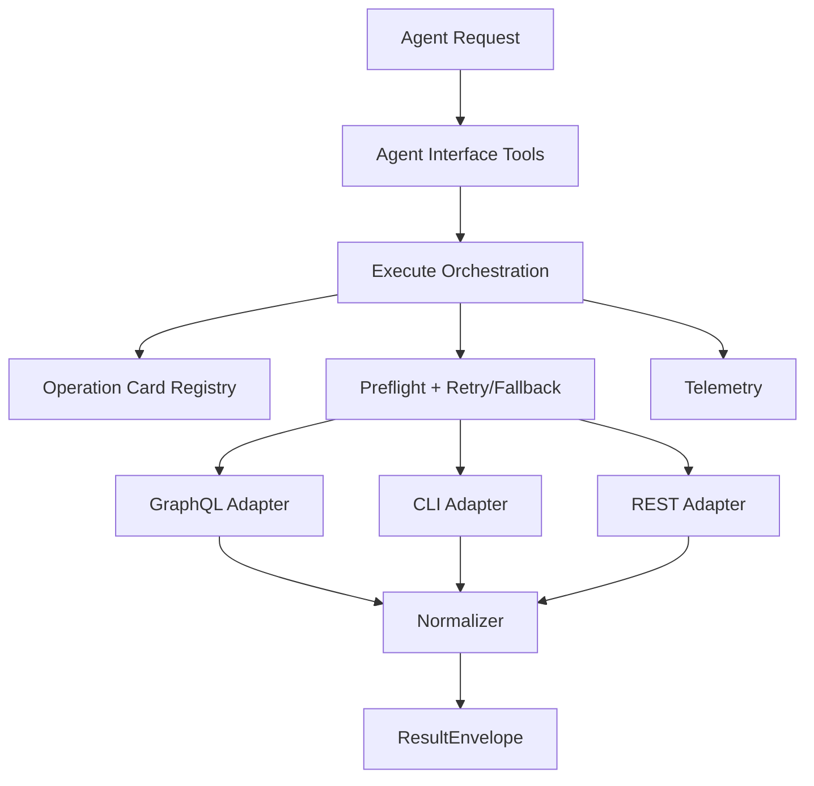

# System Design (v1)

`ghx` moves GitHub execution policy into deterministic runtime behavior.

## Goals

- stable capability contracts
- deterministic route planning and fallback
- normalized route-independent output
- benchmarkable reliability and efficiency

## Runtime Model

## Result Envelope

Every capability returns:

- `ok`: boolean
- `data`: normalized payload on success
- `error`: normalized error on failure
- `meta`: `capability_id`, `route_used`, `reason`, plus optional trace/timing fields

## Route Planning

- capability cards define preferred and fallback routes
- preflight checks gate route eligibility
- execute applies bounded retries for retryable errors
- fallback proceeds in deterministic card order

## Current Scope

- Repository + issue reads: `repo.view`, `issue.view`, `issue.list`, `issue.comments.list`
- Pull request reads: `pr.view`, `pr.list`, `pr.comments.list`, `pr.reviews.list`, `pr.diff.list_files`
- Pull request checks + mergeability: `pr.status.checks`, `pr.checks.get_failed`, `pr.mergeability.view`
- Pull request thread mutations: `pr.comment.reply`, `pr.comment.resolve`, `pr.comment.unresolve`, `pr.ready_for_review.set`
- CI diagnostics/logs: `check_run.annotations.list`, `workflow_runs.list`, `workflow_run.jobs.list`, `workflow_job.logs.get`, `workflow_job.logs.analyze`
- Route preferences are capability-specific and defined in cards (`preferred` + `fallbacks`), with REST still outside active routing for current capabilities

## Source References

- `packages/core/src/core/execute/execute.ts`
- `packages/core/src/core/registry/cards/*.yaml`
- `packages/core/src/core/contracts/envelope.ts`
- `packages/core/src/agent-interface/tools/`
