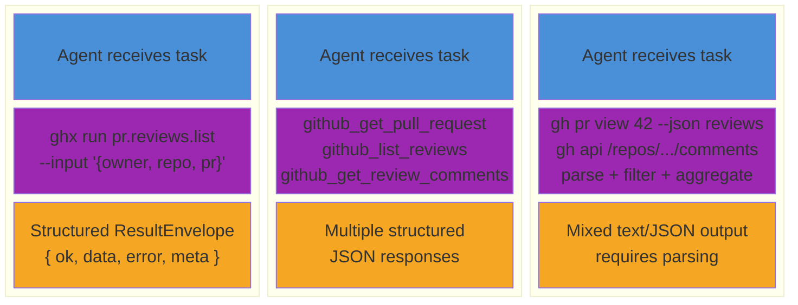

# Structured Capability Routing Reduces AI Agent Overhead on GitHub Tasks

An empirical evaluation of three tool-integration approaches for AI agents performing GitHub operations.

---

## Abstract

AI agents performing GitHub operations via raw CLI commands spend most of their time and tokens on orchestration -- discovering commands, constructing flags, parsing output, and retrying on syntax errors. We evaluate whether a structured capability router (`ghx`) can reduce this overhead while maintaining task correctness. In a controlled three-mode comparison (raw `gh` CLI vs GitHub MCP server vs `ghx` routing), ghx reduced tool calls by 73%, wall-clock latency by 54%, and active tokens by 18% compared to the baseline, with all differences statistically significant (p < 0.05, Cohen's d > 0.8). All ghx runs achieved 100% checkpoint pass rate across 30 total iterations.

---

## 1. Motivation

AI coding agents increasingly need to interact with GitHub -- reviewing PRs, replying to review threads, managing issues, triggering workflows. The standard approach is to give agents access to the `gh` CLI or raw GitHub API and let them figure out the details.

This creates a predictable failure mode: the agent spends multiple tool calls discovering the right command syntax, parsing mixed text/JSON output, and retrying when flag combinations don't work. Each retry consumes tokens and adds latency. In our baseline measurements, agents averaged 7-8 backtracking events per task -- cases where the agent reversed a previous approach or retried a failed command.

**The hypothesis:** a structured capability router that wraps GitHub operations into typed, single-call capabilities with structured input/output schemas will reduce tool call count, lower token usage, lower latency, and maintain or improve task success rate.

This evaluation tests that hypothesis by isolating the toolset as the only independent variable.

---

## 2. Experimental Design

### 2.1 Three-Mode Comparison

The evaluation compares three levels of abstraction available to AI agents interacting with GitHub:



| Mode | What the Agent Has | How It Works |
| --- | --- | --- |
| **baseline** | Raw `gh` CLI via bash | Agent must discover commands, construct flags, parse mixed output. Maximum flexibility, maximum orchestration overhead. |
| **mcp** | GitHub MCP server tools | Agent calls structured MCP tools (`github_pull_request_read`, `github_add_reply_to_pull_request_comment`). Structured but requires multiple calls for composite operations. |
| **ghx** | `ghx run <capability>` + `ghx chain` | Agent calls typed capabilities with JSON schemas. One call per operation; `ghx chain` batches multiple operations into a single tool call. |

### 2.2 Controlled Variables

The evaluation isolates the toolset as the **single independent variable**. Everything else is held constant:

| Variable | Value | Rationale |
| --- | --- | --- |
| LLM | OpenAI GPT-5.3 Codex | Single model eliminates model-specific variance |
| Agent framework | OpenCode (SSE provider) | Consistent session management |
| Task prompts | Identical across modes | Same natural-language instructions |
| GitHub state | Fixture-seeded, reset per iteration | Identical starting conditions |
| Timeout | 120,000 ms | Uniform cutoff |
| Temperature | Provider default | Consistent sampling |

### 2.3 Scenarios

Two PR-focused workflow scenarios, each testing a common agent task:

**Scenario 1: Reply to Unresolved Review Threads** (`pr-reply-threads-wf-001`)
- Difficulty: Intermediate
- Task: Read all unresolved review threads on a PR and reply to each with a concrete fix suggestion. No code changes -- only API read/write calls.
- Fixture: 3 unresolved review threads on a PR with code-quality feedback
- Checkpoints (4): threads remain unresolved + each thread receives a reply
- Expected capabilities: `pr.view`, `pr.threads.list`, `pr.threads.reply`

**Scenario 2: Review and Comment on PR** (`pr-review-comment-001`)
- Difficulty: Basic
- Task: Review the PR diff, identify bugs and style issues, submit a `REQUEST_CHANGES` review with inline comments and a summary.
- Fixture: PR with intentional code issues in the diff
- Checkpoints (2): review state is `CHANGES_REQUESTED` + at least one inline comment exists
- Expected capabilities: `pr.view`, `pr.diff.view`, `pr.reviews.submit`

### 2.4 Repetition and Sample Size

- 5 iterations per cell (mode x scenario)
- 30 total runs (3 modes x 2 scenarios x 5 iterations)
- Fixtures reset between iterations via `reseedPerIteration` (force-push branches, delete comments/reviews)

---

## 3. Metrics Framework

Four metric dimensions capture different aspects of agent performance:

### 3.1 Complexity

| Metric | Unit | Description |
| --- | --- | --- |
| Tool calls (total) | count | Total tool invocations by the agent |
| Tool calls by category | count | Breakdown: `gh_cli`, `mcp`, `bash`, `file_ops`, `other` |
| Agent turns | count | Conversation turns (prompt-response cycles) |

### 3.2 Efficiency

| Metric | Unit | Description |
| --- | --- | --- |
| Wall-clock time | ms | End-to-end task completion time |
| Active tokens | count | `input + output` tokens, excluding cache. **This is the real cost driver.** |
| Total tokens | count | All tokens including cache reads (misleading for cost comparison -- see note below) |
| Cache read tokens | count | Tokens served from prefix cache (near-zero marginal cost) |
| Reasoning tokens | count | Internal chain-of-thought tokens |

**Why active tokens, not total tokens.** ghx's system prompt (SKILL.md, ~600 tokens of capability definitions) is prefix-cached on every request. These cached tokens cost essentially nothing. Total tokens conflate expensive fresh processing with cheap cache hits. Active tokens isolate what the model processes from scratch -- the actual cost driver.

### 3.3 Correctness

| Metric | Unit | Description |
| --- | --- | --- |
| Checkpoint pass rate | % | Fraction of checkpoints passed per iteration |
| Success rate | % | Fraction of iterations where all checkpoints passed |

Checkpoints verify actual GitHub state after the agent acts -- they query the GitHub API to confirm the agent's work produced the expected outcome. This is functional correctness, not textual similarity.

### 3.4 Behavior

| Metric | Unit | Description |
| --- | --- | --- |
| Backtracking events | count | Times the agent reversed or retried a previous approach |
| Reasoning density | % | Reasoning tokens as a fraction of total output |
| Reasoning per tool call | tokens/call | How much reasoning the agent invests per action |
| Tool diversity | count | Unique tool names used per session |

### 3.5 Statistical Methods

- **Central tendency:** Medians (robust to the outlier caused by the baseline timeout failure)
- **Uncertainty:** Bootstrap 95% confidence intervals (10,000 resamples)
- **Effect size:** Cohen's d -- negligible (<0.2), small (0.2-0.5), medium (0.5-0.8), large (>0.8)
- **Significance:** Permutation tests, threshold p < 0.05
- **Variance:** Coefficient of variation (CV = stddev/mean) for run-to-run consistency

A result is considered compelling only when **both** statistically significant (p < 0.05) **and** practically meaningful (Cohen's d > 0.5).

---

## 4. Results

### 4.1 Headline Results

| Scenario | Tool Calls (vs baseline) | Active Tokens (vs baseline) | Latency (vs baseline) | Success |
| --- | --- | --- | --- | --- |
| Reply to unresolved review threads | **-73%** | **-18%** | **-54%** | 100% all 3 modes |
| Review and comment on PR | **-71%** | **-18%** | **-54%** | ghx 100%, baseline 90% |

### 4.2 Results at a Glance

| Mode | Success | Wall p50 | Wall p90 | Wall CV | Active Tok p50 | Total Tok p50 | Tool Calls p50 | Turns p50 |
| --- | --- | --- | --- | --- | --- | --- | --- | --- |
| baseline | 90% | 69.8s | 81.7s | 0.40 | 26.7k | 130.1k | 8 | 7 |
| mcp | 100% | 38.9s | 46.9s | 0.14 | 23.6k | 93.6k | 7 | 5 |
| ghx | 100% | 32.4s | 41.2s | 0.17 | 21.8k | 62.0k | 2 | 3 |

### 4.3 Statistical Comparisons

Effect sizes use Cohen's d. p-values from permutation tests. 95% CIs from bootstrap resampling (10,000 iterations).

#### baseline vs ghx

| Metric | Baseline p50 | ghx p50 | Reduction | 95% CI | Cohen's d | p-value |
| --- | --- | --- | --- | --- | --- | --- |
| Wall Time | 69.8s | 32.4s | -54% | [-167%, -73%] | 1.646 (large) | 0.004 |
| Active Tokens | 26.7k | 21.8k | -18% | [-544%, -14%] | 0.978 (large) | 0.039 |
| Tool Calls | 7.5 | 2.0 | -73% | [-400%, -125%] | 1.836 (large) | 0.003 |

All three metrics show statistically significant large effects. The tool call reduction is the most robust signal -- the CI excludes zero by a wide margin.

#### baseline vs mcp

| Metric | Baseline p50 | mcp p50 | Reduction | 95% CI | Cohen's d | p-value |
| --- | --- | --- | --- | --- | --- | --- |
| Wall Time | 69.8s | 38.9s | -44% | [-116%, -45%] | 1.294 (large) | 0.012 |
| Active Tokens | 26.7k | 23.6k | -12% | [-29%, 11%] | 0.036 (negligible) | 0.955 |
| Tool Calls | 7.5 | 7.0 | -7% | [-80%, 20%] | 0.175 (negligible) | 0.745 |

MCP significantly reduces latency over baseline but does **not** meaningfully reduce tool calls or active tokens. The agent still needs multiple MCP calls for composite operations -- the structured interface helps with parsing but not with orchestration complexity.

#### mcp vs ghx

| Metric | mcp p50 | ghx p50 | Reduction | 95% CI | Cohen's d | p-value |
| --- | --- | --- | --- | --- | --- | --- |
| Wall Time | 38.9s | 32.4s | -17% | [-46%, 0%] | 1.134 (large) | 0.015 |
| Active Tokens | 23.6k | 21.8k | -8% | [-452%, 1%] | 1.286 (large) | 0.011 |
| Tool Calls | 7.0 | 2.0 | -71% | [-300%, -100%] | 3.417 (large) | <0.001 |

ghx's largest advantage over MCP is tool call reduction (d = 3.42, the strongest signal in the dataset). The `ghx chain` command batches multiple operations into a single tool call, while MCP requires separate calls for each operation.

### 4.4 Per-Scenario Breakdown

#### Reply to Unresolved Review Threads

100% success rate across all modes and all iterations.

| Mode | Wall p50 | Active Tok p50 | Tool Calls p50 | Turns p50 |
| --- | --- | --- | --- | --- |
| baseline | 80.3s | 26.7k | 10 | 8 |
| mcp | 34.7s | 28.3k | 5 | 4 |
| ghx | 30.5s | 21.7k | 2 | 3 |

This scenario is the most demanding orchestration-wise: the agent must list threads, identify which are unresolved, then reply to each individually. Baseline agents averaged 9 backtracking events -- primarily from incorrect `gh api` endpoint paths and GraphQL syntax.

#### Review and Comment on PR

93% overall success rate (baseline had one timeout failure).

| Mode | Wall p50 | Active Tok p50 | Tool Calls p50 | Turns p50 |
| --- | --- | --- | --- | --- |
| baseline | 65.6s | 26.7k | 7 | 7 |
| mcp | 43.8s | 21.7k | 8 | 5 |
| ghx | 33.6s | 21.9k | 2 | 3 |

The review scenario requires reading a diff, analyzing code quality, and submitting a structured review with inline comments -- a composite operation that MCP splits into 7-8 calls vs ghx's 2.

### 4.5 Behavioral Analysis

#### Backtracking

| Mode | Backtracking Events (threads scenario) | Backtracking Events (review scenario) |
| --- | --- | --- |
| baseline | 9 | 6 |
| mcp | 2 | 5 |
| ghx | 1 | 1 |

Backtracking is the primary source of wasted tokens and latency in baseline mode. Common failure patterns:

- **baseline:** Incorrect `gh api` endpoint paths (e.g., `/repos/OWNER/REPO/pulls/N/comments` vs `/repos/OWNER/REPO/pulls/N/reviews/N/comments`), array parameter syntax errors, GraphQL mutation formatting
- **mcp:** Falling back to `gh api` for operations not covered by MCP tools, requiring extra calls to map MCP resource identifiers to GitHub API identifiers
- **ghx:** Rare -- one backtracking event across both scenarios, caused by a minor schema mismatch resolved on the next call

#### Tool Call Patterns

**baseline** (8-11 calls/task): read context (2-3 calls) -> attempt action (2-5 calls with retries) -> verify (1-2 calls). The agent frequently chains `gh api -> gh api` (up to 7 consecutive API calls in one session), iterating on endpoints and parameters.

**mcp** (5-9 calls/task): read context (2-3 calls) -> execute (2-4 calls) -> verify (1 call). The structured MCP interface eliminates parsing overhead but still requires separate calls for read and write operations.

**ghx** (2-3 calls/task): read context (1 call) -> execute via chain (1 call) -> optional verify (1 call). The `ghx chain` command batches the entire operation, and the typed `ResultEnvelope` output eliminates the need for a verification call in most cases.

#### Reasoning Investment

| Metric | baseline | ghx | mcp |
| --- | --- | --- | --- |
| Reasoning density | 0.7% | 0.6% | 0.5% |
| Reasoning per tool call | 116-136 tok | 150-189 tok | 44-94 tok |

ghx agents invest more reasoning tokens per tool call (183 tok/call vs 116 for baseline). This makes sense: each ghx call accomplishes more, so the agent spends proportionally more time planning each call. But the total reasoning budget is lower because fewer calls are needed.

### 4.6 Variance and Reliability

| Mode | Wall Time CV | Interpretation |
| --- | --- | --- |
| baseline | 0.40 | High variance -- some runs are fast (correct syntax on first try), others are slow (retry cascades) |
| mcp | 0.14 | Low variance -- predictable execution paths |
| ghx | 0.17 | Low variance -- consistent performance |

Baseline's CV of 0.40 means its standard deviation is 40% of its mean wall time. In practical terms: you can't predict whether a baseline run will take 40s or 82s. ghx and MCP are both 3x more predictable.

The single failure in the dataset was a baseline timeout: iteration 3 of pr-review-comment exceeded the 120s window. The session was not created, producing zero values for all metrics. Neither ghx nor MCP experienced any failures or timeouts.

### 4.7 Checkpoint Detail

All modes pass all checkpoints when runs complete successfully. The baseline failure was a timeout, not a correctness issue.

#### Reply to Unresolved Review Threads (4 checkpoints)

| Checkpoint | Condition | baseline | mcp | ghx |
| --- | --- | --- | --- | --- |
| `threads-still-unresolved` | All 3 threads remain unresolved (replied, not resolved) | 100% | 100% | 100% |
| `thread-0-has-reply` | First thread has a reply | 100% | 100% | 100% |
| `thread-1-has-reply` | Second thread has a reply | 100% | 100% | 100% |
| `thread-2-has-reply` | Third thread has a reply | 100% | 100% | 100% |

#### Review and Comment on PR (2 checkpoints)

| Checkpoint | Condition | baseline | mcp | ghx |
| --- | --- | --- | --- | --- |
| `review-state-is-request-changes` | A `CHANGES_REQUESTED` review was submitted | 100% | 100% | 100% |
| `inline-comments-exist` | At least one inline review thread exists | 100% | 100% | 100% |

---

## 5. Discussion

### Why ghx Outperforms Baseline

The primary mechanism is **orchestration elimination**. Baseline agents spend 60-70% of their tool calls on discovery and retry -- figuring out the right `gh api` endpoint, constructing the correct flag combination, and parsing mixed text/JSON output. ghx eliminates this entire class of overhead by providing typed, validated capability contracts.

The tool call reduction (73%) drives the latency reduction (54%): each tool call requires a round-trip through the agent framework (prompt -> LLM inference -> tool execution -> result processing). Fewer calls mean fewer round-trips.

### Why ghx Outperforms MCP

MCP provides structured interfaces but still requires **decomposition** -- the agent must break composite operations into multiple MCP calls (read PR, read diff, submit review, add inline comments). ghx's `chain` command batches the entire workflow into a single tool call.

This explains the tool call data: MCP uses 7 calls per task (similar to baseline's 8), while ghx uses 2. MCP's advantage over baseline is in parsing reliability (structured JSON vs mixed text), not in orchestration reduction.

### The Active Token Story

The 18% active token reduction is the smallest effect but may be the most economically significant. Active tokens -- the tokens the model processes from scratch, excluding cache -- are the direct cost driver for API-billed models. In production at scale, an 18% reduction in active tokens per task across thousands of daily agent interactions compounds into meaningful savings.

The total token difference is larger (52% reduction: 130k vs 62k), but much of this is cache differential. ghx's shorter system prompt means less context to cache, but both approaches benefit from prefix caching.

### Consistency as a Feature

ghx's low CV (0.17) compared to baseline's high CV (0.40) has practical implications for reliability engineering. When building agent workflows with SLAs or timeout budgets, predictable execution time matters as much as median speed. An agent framework that sometimes completes in 40s and sometimes in 82s is harder to build reliable systems around than one that consistently completes in 25-41s.

---

## 6. Limitations

This evaluation provides initial evidence for the capability routing hypothesis. The following limitations constrain how far the conclusions can be generalized.

**Single model.** All 30 runs use GPT-5.3 Codex. Different LLMs may interact with tool surfaces differently -- a model that is particularly good at CLI discovery might show smaller baseline overhead, narrowing the gap. Cross-model comparison (Claude, Gemini) is needed.

**Two scenarios.** The ghx capability surface covers ~70 operations across PRs, issues, releases, workflows, and repos. This evaluation tests only 2 PR-focused scenarios. The results may not generalize to scenarios involving error recovery, rate limiting, large payloads, or multi-step workflows spanning different GitHub resources.

**Five iterations per cell.** The sample size is adequate for detecting the large effects observed (Cohen's d values of 1.0-3.4 are well above detection thresholds), but may miss small effects. Doubling to 10 iterations per cell would tighten confidence intervals, particularly for the active token metric where the CI is wide.

**Cost data unavailable.** The Codex 5.3 research preview reports $0.00 for all cost fields. Cost savings must be inferred from active token counts. Once production pricing is available, cost comparisons should be re-run.

**Fixture-based scenarios only.** All scenarios use pre-seeded GitHub state (deterministic PRs, predetermined review threads). Real-world agent workflows involve discovery, unexpected errors, and state that isn't pre-configured. Fixture-based evaluation overestimates consistency.

**No human baseline.** We do not compare agent performance to human developers performing the same tasks. The evaluation compares three agent configurations against each other, not against human efficiency.

**No cross-framework comparison.** All runs use the OpenCode agent framework. Different frameworks (Claude Code, Cursor, Cline) may introduce framework-specific overhead that interacts with the toolset variable.

---

## 7. Reproducing These Results

### Prerequisites

- Node.js >= 22
- `pnpm` package manager
- `gh` CLI authenticated (`gh auth status`)
- `GITHUB_TOKEN` or `GH_TOKEN` in env with `repo` scope
- OpenAI API key (`OPENAI_API_KEY`) or another supported provider
- `opencode` CLI for agent session execution (`curl -fsSL https://opencode.ai/install | bash`)

### Setup

```bash
git clone https://github.com/aryeko/ghx.git && cd ghx
pnpm install && pnpm run build
```

### Running the Evaluation

```bash
# 1. Seed fixtures (creates PRs with review threads and diffs in a target repo)
pnpm --filter @ghx-dev/eval run eval fixture seed \
  --repo <owner>/<repo>

# 2. Run all three modes with 5 iterations
pnpm --filter @ghx-dev/eval run eval run \
  --mode baseline --mode mcp --mode ghx \
  --repetitions 5

# 3. Run a single mode for a specific scenario
pnpm --filter @ghx-dev/eval run eval run \
  --mode ghx \
  --scenario pr-reply-threads-wf-001 \
  --repetitions 5
```

### Generating Reports

```bash
# Analyze a completed run
pnpm --filter @ghx-dev/eval run eval analyze --run-id <run_id>

# Generate report
pnpm --filter @ghx-dev/eval run eval report --run-id <run_id>
```

### Output Structure

```
packages/eval/
  results/
    run_<timestamp>.jsonl       # one JSON row per iteration
  reports/
    run_<timestamp>/
      report.md                 # summary report
      analysis.md               # behavioral analysis
      data/
        results.json            # structured row-level data
        results.csv             # flat tabular export
        summary.json            # aggregate statistics
      sessions/
        <scenario-id>/          # full session transcripts per iteration
      analysis/
        <scenario-id>/          # behavioral analysis bundles per session
```

### Verifying Against Bundled Data

The raw data from this evaluation is bundled in [`eval-report-data/`](./eval-report-data/). To verify any number in this report:

1. Open [`eval-report-data/data/results.csv`](./eval-report-data/data/results.csv) for per-iteration metrics
2. Inspect session transcripts in [`eval-report-data/sessions/`](./eval-report-data/sessions/) for raw tool call logs
3. Check [`eval-report-data/data/results.json`](./eval-report-data/data/results.json) for nested detail (individual tool call records, checkpoint API responses)
4. See the [data dictionary](./eval-report-data/README.md) for column definitions and file schemas

---

## 8. Per-Iteration Raw Data

<details>
<summary>Reply to Unresolved Review Threads -- all 15 iterations</summary>

| Iter | Mode | Success | Wall (s) | Active Tok | Cache Read | Tool Calls | Turns |
| --- | --- | --- | --- | --- | --- | --- | --- |
| 0 | baseline | pass | 69.3 | 25,233 | 75,776 | 8 | 5 |
| 0 | mcp | pass | 36.5 | 28,413 | 59,775 | 5 | 4 |
| 0 | ghx | pass | 26.1 | 22,563 | 39,168 | 2 | 3 |
| 1 | baseline | pass | 82.8 | 30,837 | 132,736 | 11 | 8 |
| 1 | mcp | pass | 32.7 | 28,336 | 60,288 | 5 | 4 |
| 1 | ghx | pass | 41.3 | 21,847 | 39,808 | 2 | 3 |
| 2 | baseline | pass | 80.3 | 26,673 | 152,576 | 10 | 9 |
| 2 | mcp | pass | 31.3 | 23,765 | 65,536 | 5 | 4 |
| 2 | ghx | pass | 27.8 | 21,667 | 39,808 | 2 | 3 |
| 3 | baseline | pass | 41.8 | 24,524 | 34,944 | 2 | 3 |
| 3 | mcp | pass | 38.8 | 30,241 | 98,304 | 7 | 6 |
| 3 | ghx | pass | 30.5 | 4,151 | 79,232 | 3 | 4 |
| 4 | baseline | pass | 81.6 | 47,882 | 115,584 | 11 | 8 |
| 4 | mcp | pass | 34.7 | 23,442 | 34,944 | 4 | 3 |
| 4 | ghx | pass | 35.5 | 3,269 | 58,496 | 2 | 3 |

</details>

<details>
<summary>Review and Comment on PR -- all 15 iterations</summary>

| Iter | Mode | Success | Wall (s) | Active Tok | Cache Read | Tool Calls | Turns |
| --- | --- | --- | --- | --- | --- | --- | --- |
| 0 | baseline | pass | 65.6 | 27,783 | 117,888 | 7 | 7 |
| 0 | mcp | pass | 46.8 | 20,963 | 73,216 | 9 | 5 |
| 0 | ghx | pass | 41.1 | 17,646 | 64,896 | 3 | 4 |
| 1 | baseline | pass | 70.3 | 26,738 | 110,336 | 6 | 7 |
| 1 | mcp | pass | 43.8 | 21,370 | 72,192 | 8 | 5 |
| 1 | ghx | pass | 36.2 | 23,398 | 59,008 | 3 | 4 |
| 2 | baseline | pass | 61.2 | 25,081 | 78,464 | 7 | 5 |
| 2 | mcp | pass | 39.1 | 22,020 | 72,448 | 8 | 5 |
| 2 | ghx | pass | 25.2 | 21,987 | 39,808 | 2 | 3 |
| 3 | baseline | FAIL | 0.0 | 0 | 0 | 0 | 0 |
| 3 | mcp | pass | 41.5 | 21,742 | 88,832 | 7 | 6 |
| 3 | ghx | pass | 31.1 | 4,103 | 58,240 | 2 | 3 |
| 4 | baseline | pass | 77.8 | 29,139 | 93,952 | 9 | 6 |
| 4 | mcp | pass | 47.9 | 40,334 | 53,376 | 8 | 5 |
| 4 | ghx | pass | 33.6 | 23,057 | 39,168 | 2 | 3 |

Baseline iteration 3 failed with a 120s timeout. Zero values reflect no data collected.

</details>

---

## 9. Further Reading

- [Evaluation Hypothesis](../packages/eval/docs/methodology/thesis.md) -- the formal hypothesis and predictions
- [Evaluation Design](../packages/eval/docs/methodology/evaluation-design.md) -- full experimental protocol
- [Metrics Reference](../packages/eval/docs/methodology/metrics.md) -- metric definitions and computation
- [Interpreting Results](../packages/eval/docs/methodology/interpreting-results.md) -- statistical methods and interpretation guide
- [Raw Data and Data Dictionary](./eval-report-data/README.md) -- schema documentation for all bundled data files
- [Quick Start](../packages/eval/docs/getting-started/quick-start.md) -- set up the eval environment
- [Adding Scenarios](../packages/eval/docs/contributing/adding-scenarios.md) -- create custom evaluation scenarios
