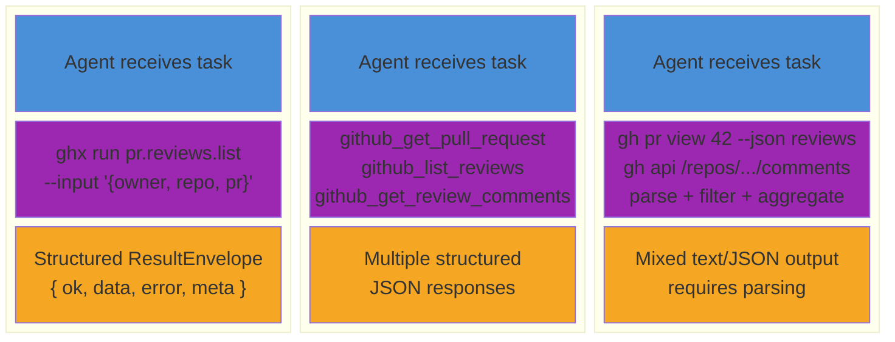

# Evaluation Results

Evidence for the ghx hypothesis: a structured capability router reduces tool calls, tokens, latency, and cost while maintaining or improving correctness.

## Methodology

The evaluation isolates the **toolset** as the single independent variable. Three modes represent three levels of abstraction available to agents today:



- **ghx mode** -- the agent calls `ghx run <capability>` with structured input schemas and `ResultEnvelope` output. One call per operation, batching via `ghx chain`.
- **mcp mode** -- the agent uses GitHub MCP server tools (`github_create_review`, `github_get_pr`, etc.). Structured but often requires multiple calls for composite operations.
- **baseline mode** -- the agent uses raw `gh` CLI commands via bash. Maximum flexibility, but the agent must discover commands, construct flags, and parse output.

**Controlled variables:** same agent framework, same LLM (Codex 5.3), same task prompt, same starting GitHub state (fixtures reset before each iteration). Only the system instructions and available tools change between modes.

**Key metric: active tokens.** Total tokens can be misleading because ghx's system prompt (SKILL.md, ~600 tokens of capability definitions) adds cached tokens to every request. Cached tokens are served from prefix cache and cost essentially nothing. Active tokens -- newly generated or newly read text the model processes from scratch -- are the real cost driver.

Full methodology: [Hypothesis](../packages/eval/docs/methodology/thesis.md) | [Evaluation Design](../packages/eval/docs/methodology/evaluation-design.md)

---

## Headline Results

Three-mode comparison (baseline vs mcp vs ghx), 30 runs, Codex 5.3. All ghx runs achieved 100% success rate.

| Scenario | Tool Calls (vs baseline) | Active Tokens (vs baseline) | Latency (vs baseline) | Success |
| --- | --- | --- | --- | --- |
| Reply to unresolved review threads | **-73%** | **-18%** | **-54%** | 100% all 3 modes |
| Review and comment on PR | **-71%** | **-18%** | **-54%** | ghx 100%, baseline 90% |

---

## Three-Mode Comparison (2026-03-03)

| Field | Value |
| --- | --- |
| Run ID | `run_1772555729706` |
| Model | `gpt-5.3-codex` (OpenAI via opencode) |
| Date | 2026-03-03 |
| Modes | baseline, mcp, ghx |
| Scenarios | 2 (reply to unresolved threads, review and comment on PR) |
| Iterations | 5 per scenario per mode |
| Total runs | 30 |

### Results at a Glance

| Mode | Success | Wall p50 | Wall CV | Active Tok p50 | Tool Calls p50 | Turns p50 |
| --- | --- | --- | --- | --- | --- | --- |
| baseline | 90% | 69.8s | 0.40 | 26.7k | 8 | 7 |
| mcp | 100% | 38.9s | 0.14 | 23.6k | 7 | 5 |
| ghx | 100% | 32.4s | 0.17 | 21.8k | 2 | 3 |

ghx achieves the lowest latency, fewest tool calls, and fewest agent turns while maintaining 100% success. Baseline had one timeout failure (iteration 3 of pr-review-comment, 120s timeout exceeded).

### Statistical Comparisons

Effect sizes use Cohen's d. All p-values from permutation tests.

#### baseline vs ghx

| Metric | Baseline p50 | ghx p50 | Reduction | 95% CI | Cohen's d | p-value |
| --- | --- | --- | --- | --- | --- | --- |
| Wall Time | 69.8s | 32.4s | -54% | [-167%, -73%] | 1.646 (large) | 0.004 |
| Active Tokens | 26.7k | 21.8k | -18% | [-544%, -14%] | 0.978 (large) | 0.039 |
| Tool Calls | 7.5 | 2.0 | -73% | [-400%, -125%] | 1.836 (large) | 0.003 |

All three metrics show statistically significant large effects (p < 0.05, Cohen's d > 0.8).

#### baseline vs mcp

| Metric | Baseline p50 | mcp p50 | Reduction | 95% CI | Cohen's d | p-value |
| --- | --- | --- | --- | --- | --- | --- |
| Wall Time | 69.8s | 38.9s | -44% | [-116%, -45%] | 1.294 (large) | 0.012 |
| Active Tokens | 26.7k | 23.6k | -12% | [-29%, 11%] | 0.036 (negligible) | 0.955 |
| Tool Calls | 7.5 | 7.0 | -7% | [-80%, 20%] | 0.175 (negligible) | 0.745 |

MCP significantly reduces latency vs baseline but does not meaningfully reduce tool calls or active tokens. The agent still needs multiple MCP tool calls to accomplish composite operations.

#### mcp vs ghx

| Metric | mcp p50 | ghx p50 | Reduction | 95% CI | Cohen's d | p-value |
| --- | --- | --- | --- | --- | --- | --- |
| Wall Time | 38.9s | 32.4s | -17% | [-46%, 0%] | 1.134 (large) | 0.015 |
| Active Tokens | 23.6k | 21.8k | -8% | [-452%, 1%] | 1.286 (large) | 0.011 |
| Tool Calls | 7.0 | 2.0 | -71% | [-300%, -100%] | 3.417 (large) | 0.000 |

ghx's largest advantage over MCP is tool call reduction (d = 3.42, p < 0.001). The `ghx chain` command batches multiple operations into a single tool call, while MCP requires separate calls for each operation.

### Tool Usage Breakdown

| Metric | baseline p50 | mcp p50 | ghx p50 |
| --- | --- | --- | --- |
| GH CLI Commands | 8 | 0 | 0 |
| MCP Tools | 0 | 7 | 0 |
| Bash Commands (ghx) | 0 | 0 | 2 |
| Total Tool Calls | 8 | 7 | 2 |

Each mode uses its designated tool surface. ghx achieves the same outcomes with 2 bash commands (typically one `ghx chain` + one `ghx run`) vs 7-8 calls in the other modes.

### Checkpoint Pass Rates

#### Reply to Unresolved Review Threads (4 checkpoints)

| Checkpoint | baseline | mcp | ghx |
| --- | --- | --- | --- |
| Threads remain unresolved (replied, not resolved) | 100% | 100% | 100% |
| Thread 0 has reply | 100% | 100% | 100% |
| Thread 1 has reply | 100% | 100% | 100% |
| Thread 2 has reply | 100% | 100% | 100% |

#### Review and Comment on PR (2 checkpoints)

| Checkpoint | baseline | mcp | ghx |
| --- | --- | --- | --- |
| REQUEST_CHANGES review submitted | 100% | 100% | 100% |
| Inline review comments exist | 100% | 100% | 100% |

All modes pass all checkpoints when runs complete successfully. The baseline failure in iteration 3 of pr-review-comment was a timeout (120s), not a correctness issue.

### Per-Iteration Raw Data

<details>
<summary>Reply to Unresolved Review Threads -- all 15 iterations</summary>

| Iter | Mode | Success | Wall (s) | Active Tok | Cache Read | Tool Calls | Turns |
| --- | --- | --- | --- | --- | --- | --- | --- |
| 0 | baseline | pass | 69.3 | 25,233 | 75,776 | 8 | 5 |
| 0 | ghx | pass | 26.1 | 22,581 | 39,233 | 2 | 3 |
| 0 | mcp | pass | 36.5 | 28,413 | 59,775 | 5 | 4 |
| 1 | baseline | pass | 82.8 | 30,812 | 132,742 | 11 | 8 |
| 1 | ghx | pass | 41.3 | 21,795 | 39,838 | 2 | 3 |
| 1 | mcp | pass | 32.7 | 28,270 | 60,274 | 5 | 4 |
| 2 | baseline | pass | 80.3 | 26,702 | 152,595 | 10 | 9 |
| 2 | ghx | pass | 27.8 | 21,715 | 39,780 | 2 | 3 |
| 2 | mcp | pass | 31.3 | 23,769 | 65,521 | 5 | 4 |
| 3 | baseline | pass | 41.8 | 24,483 | 34,884 | 2 | 3 |
| 3 | ghx | pass | 30.5 | 4,226 | 79,244 | 3 | 4 |
| 3 | mcp | pass | 38.8 | 30,198 | 98,317 | 7 | 6 |
| 4 | baseline | pass | 81.6 | 47,862 | 115,637 | 11 | 8 |
| 4 | ghx | pass | 35.5 | 3,331 | 58,487 | 2 | 3 |
| 4 | mcp | pass | 34.7 | 23,433 | 34,939 | 4 | 3 |

</details>

<details>
<summary>Review and Comment on PR -- all 15 iterations</summary>

| Iter | Mode | Success | Wall (s) | Active Tok | Cache Read | Tool Calls | Turns |
| --- | --- | --- | --- | --- | --- | --- | --- |
| 0 | baseline | pass | 65.6 | 27,760 | 117,940 | 7 | 7 |
| 0 | ghx | pass | 41.1 | 17,618 | 64,871 | 3 | 4 |
| 0 | mcp | pass | 46.8 | 20,974 | 73,235 | 9 | 5 |
| 1 | baseline | pass | 70.3 | 26,696 | 110,305 | 6 | 7 |
| 1 | ghx | pass | 36.2 | 23,433 | 59,016 | 3 | 4 |
| 1 | mcp | pass | 43.8 | 21,444 | 72,159 | 8 | 5 |
| 2 | baseline | pass | 61.2 | 25,123 | 78,472 | 7 | 5 |
| 2 | ghx | pass | 25.2 | 21,976 | 39,793 | 2 | 3 |
| 2 | mcp | pass | 39.1 | 22,042 | 72,415 | 8 | 5 |
| 3 | baseline | FAIL | 0.0 | 0 | 0 | 0 | 0 |
| 3 | ghx | pass | 31.1 | 4,132 | 58,205 | 2 | 3 |
| 3 | mcp | pass | 41.5 | 21,703 | 88,780 | 7 | 6 |
| 4 | baseline | pass | 77.8 | 29,108 | 93,956 | 9 | 6 |
| 4 | ghx | pass | 33.6 | 23,144 | 39,237 | 2 | 3 |
| 4 | mcp | pass | 47.9 | 40,329 | 53,384 | 8 | 5 |

Baseline iteration 3 failed with a 120s timeout -- the agent did not complete the task within the allowed window. Zero values reflect no data collected.

</details>

---

## Behavioral Analysis

Data from the three-mode comparison (2026-03-03).

### Backtracking Events

| Mode | Backtracking Events |
| --- | --- |
| baseline | 7 |
| mcp | 4 |
| ghx | 1 |

Backtracking occurs when the agent retries a failed approach or reverses a previous action. Baseline agents frequently backtrack on API syntax errors, particularly with array parameters and GraphQL mutation formatting. ghx's structured input schemas eliminate this class of error.

### Tool Call Patterns

- **baseline** -- 8-11 tool calls per task. Pattern: read context (2-3 calls), attempt action (2-5 calls with retries), verify (1-2 calls).
- **mcp** -- 5-9 tool calls per task. Pattern: read context (2-3 calls), execute action (2-4 calls), verify (1 call).
- **ghx** -- 2-3 tool calls per task. Pattern: read context (1 call), execute action via chain (1 call), optional verify (1 call).

### Consistency

| Mode | Wall Time CV |
| --- | --- |
| baseline | 0.40 |
| mcp | 0.14 |
| ghx | 0.17 |

The coefficient of variation (CV) measures run-to-run consistency. Baseline's CV of 0.40 reflects high variance -- some runs are fast (when the agent guesses the right syntax early), others are slow (when retries cascade). ghx and MCP are both more consistent (CV 0.14-0.17), indicating predictable execution paths.

---

## Limitations

- **Single model.** Both evaluation runs use Codex 5.3. Cross-model comparison (Claude, Gemini) is needed to validate generalizability. Preliminary Gemini runs are in progress.
- **2 scenarios.** The 70-capability surface is tested on 2 workflow scenarios. Expanding scenario coverage -- particularly for edge cases like rate limiting, large payloads, and error recovery -- would strengthen the evidence.
- **5 iterations per cell.** Adequate for detecting large effects (the observed Cohen's d values of 1.0-3.4 are well above the detection threshold), but may miss small effects. More iterations would tighten confidence intervals.
- **Cost shows $0.00.** The Codex 5.3 research preview does not report cost. In production, active token counts would determine cost differences. The active-token reductions suggest meaningful cost savings.
- **Fixture-based scenarios only.** All scenarios use pre-seeded GitHub state. Real-world agent workflows may involve discovery, error handling, and state that isn't pre-configured.

---

## Reproducing These Results

### Prerequisites

- Node.js >= 22
- `pnpm` package manager
- `gh` CLI authenticated (`gh auth status`)
- `GITHUB_TOKEN` or `GH_TOKEN` in env with `repo` scope
- OpenAI API key (`OPENAI_API_KEY`) or another supported provider
- `opencode` CLI for agent session execution (`curl -fsSL https://opencode.ai/install | bash`)

### Setup

```bash
git clone https://github.com/aryeko/ghx.git && cd ghx
pnpm install && pnpm run build
```

### Run an evaluation

```bash
# Seed fixtures (creates PRs, issues, workflow runs in a target repo)
pnpm --filter @ghx-dev/eval run eval fixture seed \
  --repo <owner>/<repo>

# Run all three modes (baseline, mcp, ghx) with 5 iterations
pnpm --filter @ghx-dev/eval run eval run \
  --mode baseline --mode mcp --mode ghx \
  --repetitions 5

# Run a single mode for a specific scenario
pnpm --filter @ghx-dev/eval run eval run \
  --mode ghx \
  --scenario pr-reply-threads-wf-001 \
  --repetitions 5
```

### Generate reports from existing results

```bash
# Analyze a completed run
pnpm --filter @ghx-dev/eval run eval analyze --run-id <run_id>

# Generate report
pnpm --filter @ghx-dev/eval run eval report --run-id <run_id>
```

### Output structure

Results and reports are written to `packages/eval/` (gitignored):

```
packages/eval/
  results/
    run_<timestamp>.jsonl       # one JSON row per iteration
  reports/
    run_<timestamp>/
      report.md                 # full Markdown report
      analysis.md               # behavioral analysis
      data/
        results.json            # structured results
        results.csv             # CSV export
        summary.json            # aggregate statistics
      sessions/
        <scenario-id>/          # full session traces per iteration
      analysis/
        <scenario-id>/          # behavioral analysis bundles
```

### JSONL row format

Each line in the results JSONL is a self-contained JSON object:

```json
{
  "runId": "run_1772555729706",
  "scenarioId": "pr-reply-threads-wf-001",
  "mode": "ghx",
  "model": "openai/gpt-5.3-codex",
  "iteration": 0,
  "tokens": {
    "input": 22444,
    "output": 1935,
    "reasoning": 854,
    "cacheRead": 75776,
    "active": 25233,
    "total": 101009
  },
  "timing": { "wallMs": 26134 },
  "toolCalls": {
    "total": 2,
    "byCategory": { "bash": 2 },
    "failed": 0
  },
  "checkpoints": { "passed": 4, "total": 4 }
}
```

### Further reading

- [Quick Start](../packages/eval/docs/getting-started/quick-start.md) -- set up the eval environment
- [Running Evaluations](../packages/eval/docs/guides/running-evaluations.md) -- run scenarios and generate reports
- [Adding Scenarios](../packages/eval/docs/contributing/adding-scenarios.md) -- create custom scenarios
- [Evaluation Design](../packages/eval/docs/methodology/evaluation-design.md) -- understand the statistical approach
