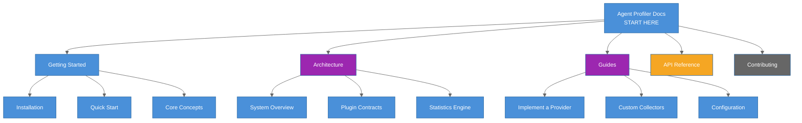

# Agent Profiler Documentation

The `@ghx-dev/agent-profiler` package is a generic TypeScript framework for profiling AI agent session performance -- measuring latency, tokens, tool calls, cost, and behavioral patterns across execution modes.

## Quick Navigation

## Why Agent Profiler?

Eval frameworks answer "did the agent succeed?" Agent profiler answers "how efficiently did it succeed, and why?"

| Concern | Eval Frameworks | Agent Profiler |
|---------|----------------|----------------|
| Success/failure | Checkpoints and assertions | Checkpoints via pluggable Scorer |
| Token efficiency | Not measured | Per-category breakdown (input, output, reasoning, cache) |
| Behavioral analysis | Not measured | 5 built-in analyzers (reasoning, strategy, efficiency, tool-pattern, error) |
| Statistical rigor | Single-run pass/fail | Bootstrap CI, Cohen's d, permutation tests across repetitions |
| Cost tracking | Not measured | USD breakdown by token category |
| Cross-mode comparison | Manual | Automated with confidence intervals and effect sizes |

## By Use Case

### I want to profile agent sessions

Start here: **[Getting Started](getting-started/README.md)**

- [Installation](getting-started/installation.md) -- Prerequisites and package setup
- [Quick Start](getting-started/quick-start.md) -- Complete runnable example in 50 lines
- [Core Concepts](getting-started/concepts.md) -- Mental model and plugin-first architecture

### I want to understand the architecture

Read: **[Architecture Documentation](architecture/README.md)**

- [System Overview](architecture/overview.md) -- Data flow and layer diagram
- [Plugin Contracts](architecture/plugin-contracts.md) -- All 6 contracts with full interfaces
- [Statistics Engine](architecture/statistics.md) -- Bootstrap CI, Cohen's d, permutation tests

### I want to implement custom plugins

See: **[Guides](guides/README.md)**

- [Implementing a Provider](guides/implementing-a-provider.md) -- Step-by-step SessionProvider
- [Implementing a Scorer](guides/implementing-a-scorer.md) -- Step-by-step Scorer
- [Custom Collectors](guides/custom-collectors.md) -- Extract additional metrics
- [Custom Analyzers](guides/custom-analyzers.md) -- Add behavioral analysis

### I want API reference

Check: **[API Reference](api/README.md)**

- [ProfileRow](api/profile-row.md) -- Field-by-field type reference
- [Metric Types](api/metric-types.md) -- TokenBreakdown, TimingBreakdown, CostBreakdown
- [Public API](api/public-api.md) -- All exported functions and types

### I want to contribute

See: **[Contributing](contributing/README.md)**

- [Development Setup](contributing/development-setup.md) -- Clone, build, test
- [Adding a Plugin](contributing/adding-a-plugin.md) -- Add built-in collectors or analyzers

## Key Facts

**6 Plugin Contracts** -- the extension points of the profiler:

| Contract | Purpose | Built-in |
|----------|---------|----------|
| `SessionProvider` | Drive agent sessions (create, prompt, export, destroy) | None (you implement) |
| `Scorer` | Evaluate agent output against checkpoints | None (you implement) |
| `Collector` | Extract custom metrics from prompt results | Token, Latency, Cost, ToolCall |
| `Analyzer` | Produce structured findings from session traces | Reasoning, Strategy, Efficiency, ToolPattern, Error |
| `ModeResolver` | Map mode names to environment and instructions | None (you implement) |
| `RunHooks` | Lifecycle callbacks at run, mode, and iteration boundaries | None (you implement) |

**Statistical Methods:**

- Descriptive statistics (mean, median, p90, p95, IQR, CV, stddev)
- Bootstrap confidence intervals (percentile method, seeded PRNG)
- Cohen's d effect size with magnitude classification
- Permutation tests for significance

**Report Output:**

- Multi-page Markdown reports (summary, metrics, analysis, comparison, per-scenario)
- CSV and JSON data exports
- Aggregated summary JSON

## Requirements

- Node.js 22+
- TypeScript with strict mode

## Related Documentation

- [Package README](../README.md) -- npm-facing overview
- [ghx Documentation Hub](../../../docs/README.md) -- Root documentation
