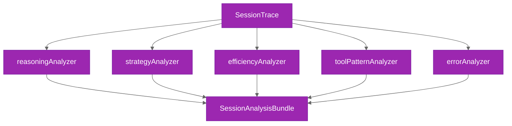

# Built-in Analyzers

Reference for the 5 built-in Analyzer implementations and their findings.

Each analyzer implements the `Analyzer` interface and produces an `AnalysisResult` containing structured findings and a human-readable summary. Analyzers run only when a `SessionTrace` is available (i.e., when `sessionExport` is enabled or analyzers are registered).

```typescript
import {
  reasoningAnalyzer,
  strategyAnalyzer,
  efficiencyAnalyzer,
  toolPatternAnalyzer,
  errorAnalyzer,
} from "@ghx-dev/agent-profiler"
```

## Trace Pipeline



All 5 analyzers run independently against the same `SessionTrace`. Their results are aggregated into a `SessionAnalysisBundle` for reporting.

## reasoningAnalyzer

Measures reasoning density, planning quality, and identifies key decisions and confusion signals.

- **name:** `"reasoning"`
- **Source:** `packages/agent-profiler/src/analyzer/reasoning-analyzer.ts`

### Findings

| Key | Type | Unit | Description |
|-----|------|------|-------------|
| `reasoning_density` | number | ratio | Reasoning tokens divided by total tokens |
| `reasoning_per_tool_call` | number | tokens/tool_call | Average reasoning tokens per tool invocation |
| `planning_quality` | string | -- | Classification: `"proactive"`, `"reactive"`, or `"mixed"` |
| `key_decisions` | list | -- | First 50 characters of each reasoning event |
| `confusion_signals` | list | -- | Reasoning blocks containing confusion keywords (e.g., "unsure", "unclear", "confused") |

**Planning quality classification:**

- **proactive** -- reasoning events precede the majority of tool calls, indicating upfront planning
- **reactive** -- reasoning events follow tool calls, indicating response-driven decision making
- **mixed** -- no dominant pattern

## strategyAnalyzer

Classifies the agent's overall problem-solving strategy based on tool usage patterns and reasoning density.

- **name:** `"strategy"`
- **Source:** `packages/agent-profiler/src/analyzer/strategy-analyzer.ts`

### Findings

| Key | Type | Unit | Description |
|-----|------|------|-------------|
| `strategy_summary` | string | -- | Classification: `"direct"`, `"iterative"`, or `"exploratory"` |
| `strategy_steps` | list | -- | Phase descriptions (e.g., "exploration phase: 3 read calls") |
| `optimality_notes` | list | -- | Warnings about high error rate, redundant calls, or strong reasoning |

**Strategy classification:**

- **direct** -- 5 or fewer tool calls with no backtracking
- **iterative** -- more than 5 tool calls or evidence of backtracking
- **exploratory** -- more than 5 unique tools used or reasoning density exceeds 30%

## efficiencyAnalyzer

Measures turn-level productivity and information redundancy within a session.

- **name:** `"efficiency"`
- **Source:** `packages/agent-profiler/src/analyzer/efficiency-analyzer.ts`

### Findings

| Key | Type | Unit | Description |
|-----|------|------|-------------|
| `total_turns` | number | turns | Total number of turns in the session |
| `productive_turns` | number | turns | Turns containing a successful tool call or meaningful text output |
| `wasted_turns` | number | turns | Turns with no productive outcome |
| `turn_efficiency` | number | ratio | `productive_turns / total_turns` |
| `information_redundancy` | number | ratio | Duplicate tool calls (same tool + same input) divided by total tool calls |
| `backtracking_events` | number | events | Instances where the agent revisited a previously completed step |

## toolPatternAnalyzer

Identifies sequential tool usage patterns, redundant invocations, and retry behavior.

- **name:** `"tool-pattern"`
- **Source:** `packages/agent-profiler/src/analyzer/tool-pattern-analyzer.ts`

### Findings

| Key | Type | Unit | Description |
|-----|------|------|-------------|
| `tool_sequence` | list | -- | Ordered list of tool names as invoked |
| `unique_tools_used` | number | tools | Count of distinct tool names |
| `tool_call_patterns` | table | pattern, count | Bigram frequencies (consecutive tool pairs) |
| `redundant_calls` | table | tool, input_hash, count | Same tool with identical input called multiple times |
| `failed_then_retried` | table | tool, occurrences | Immediate retry after a failed tool call |

**Table formats:**

`tool_call_patterns` example:

| Pattern | Count |
|---------|-------|
| `read -> edit` | 4 |
| `edit -> read` | 2 |
| `grep -> read` | 3 |

`redundant_calls` example:

| Tool | Input Hash | Count |
|------|-----------|-------|
| `file_read` | `a1b2c3` | 3 |

`failed_then_retried` example:

| Tool | Occurrences |
|------|-------------|
| `bash` | 2 |

## errorAnalyzer

Categorizes errors, quantifies recovery patterns, and identifies error cascades.

- **name:** `"error"`
- **Source:** `packages/agent-profiler/src/analyzer/error-analyzer.ts`

### Error Types

| Type | Description |
|------|-------------|
| `auth` | Authentication or authorization failures |
| `not_found` | Resource not found errors |
| `timeout` | Operation timeout errors |
| `parse_error` | JSON or response parsing failures |
| `unknown` | Errors that do not match any known category |

### Findings

| Key | Type | Unit | Description |
|-----|------|------|-------------|
| `errors_encountered` | number | errors | Total error count across the session |
| `error_types` | table | type, count | Breakdown of errors by category |
| `recovery_patterns` | table | pattern, count | How the agent responds to errors |
| `error_cascades` | number | cascades | Sequences of 2 or more consecutive errors |
| `wasted_turns_from_errors` | number | turns | Turns consumed by errors and failed recovery attempts |

**Recovery patterns:**

| Pattern | Description |
|---------|-------------|
| `retry` | Agent retries the same tool call after a failure |
| `alternative` | Agent tries a different tool after a failed tool call |
| `tool_followup` | Agent follows a non-tool error event with a tool call |
| `give_up` | Agent abandons the task or moves on without resolution |

## Related Documentation

- [Plugin Contracts](./plugin-contracts.md)
- [Built-in Collectors](./built-in-collectors.md)
- [System Overview](./overview.md)
- [Statistics Engine](./statistics.md)
