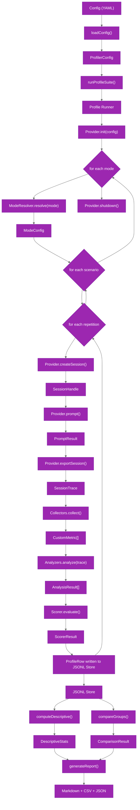

# System Overview

Understand the complete data flow from configuration to generated reports.

## Full-System Flow

## Architectural Layers

The profiler organizes into four distinct layers, each with a clear responsibility boundary.

### 1. Configuration

The configuration layer loads and validates YAML profile definitions into typed `ProfilerConfig` objects.

| Source File | Responsibility |
|-------------|----------------|
| `packages/agent-profiler/src/config/schema.ts` | Zod schemas for profile YAML validation |
| `packages/agent-profiler/src/config/loader.ts` | File loading, environment variable interpolation, defaults |

The loader reads a YAML file, applies environment variable substitution, validates the result against the Zod schema, and returns a frozen `ProfilerConfig` object. Invalid configurations fail fast with descriptive error messages.

### 2. Execution

The execution layer expands the configuration into a mode-by-scenario-by-repetition matrix and runs each iteration through the provider lifecycle.

| Source File | Responsibility |
|-------------|----------------|
| `packages/agent-profiler/src/runner/profile-runner.ts` | Suite orchestration, matrix expansion, hook dispatch |
| `packages/agent-profiler/src/runner/iteration.ts` | Single-iteration lifecycle with retry handling |
| `packages/agent-profiler/src/runner/warmup.ts` | Optional canary run before the main suite |

The runner calls `ModeResolver.resolve()` once per mode, then iterates through scenarios and repetitions. Each iteration creates a fresh session, sends the prompt, collects metrics, exports the trace (when applicable), runs analyzers, evaluates the scorer, and writes a `ProfileRow` to the JSONL store.

### 3. Collection and Analysis

The collection and analysis layer transforms raw execution results into structured metrics and qualitative findings.

| Source File | Responsibility |
|-------------|----------------|
| `packages/agent-profiler/src/collector/*.ts` | Metric extraction from PromptResult and SessionTrace |
| `packages/agent-profiler/src/analyzer/*.ts` | Qualitative analysis of session traces |
| `packages/agent-profiler/src/contracts/*.ts` | Interface definitions for all plugin contracts |

Collectors run after every prompt and produce `CustomMetric[]` values stored in `ProfileRow.extensions`. Analyzers run only when a `SessionTrace` is available and produce `AnalysisResult` objects containing findings and summaries.

### 4. Reporting

The reporting layer consumes the JSONL store and produces statistical summaries and formatted reports.

| Source File | Responsibility |
|-------------|----------------|
| `packages/agent-profiler/src/stats/descriptive.ts` | Mean, median, percentiles, standard deviation |
| `packages/agent-profiler/src/stats/bootstrap.ts` | Bootstrap confidence intervals and reduction CIs |
| `packages/agent-profiler/src/stats/comparison.ts` | Cohen's d effect size and permutation tests |
| `packages/agent-profiler/src/reporter/*.ts` | Markdown, CSV, and JSON report generation |
| `packages/agent-profiler/src/store/*.ts` | JSONL append and read operations |

The statistics engine computes descriptive statistics per metric per mode, then uses bootstrap resampling and permutation tests to compare groups. The reporter formats these results into human-readable Markdown tables, machine-readable CSV, and structured JSON.

## Related Documentation

- [Profile Runner](./runner.md)
- [Plugin Contracts](./plugin-contracts.md)
- [Built-in Collectors](./built-in-collectors.md)
- [Built-in Analyzers](./built-in-analyzers.md)
- [Statistics Engine](./statistics.md)
