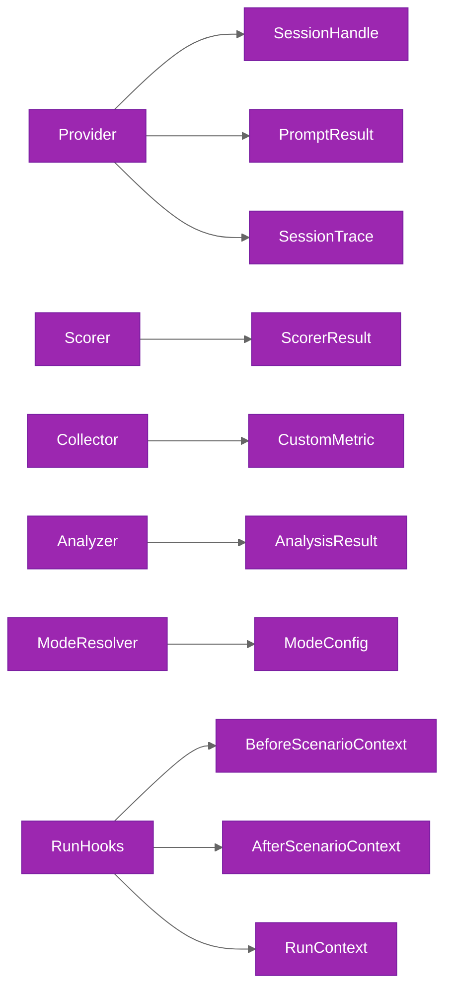

# Plugin Contracts

Understand all 6 extension contracts, their TypeScript interfaces, and implementation gotchas.

## Contract Relationships



## SessionProvider

The session provider is the primary integration point. It manages the lifecycle of agent sessions from creation through prompting to export and destruction.

Source: `packages/agent-profiler/src/contracts/provider.ts`

```typescript
interface SessionProvider {
  readonly id: string
  init(config: ProviderConfig): Promise<void>
  createSession(params: CreateSessionParams): Promise<SessionHandle>
  prompt(handle: SessionHandle, text: string, timeoutMs?: number): Promise<PromptResult>
  exportSession(handle: SessionHandle): Promise<SessionTrace>
  destroySession(handle: SessionHandle): Promise<void>
  shutdown(): Promise<void>
}
```

**When called during execution:**

| Method | Timing |
|--------|--------|
| `init` | Once per suite, before the mode loop begins |
| `createSession` | Once per iteration (or retry attempt) |
| `prompt` | Once per iteration, after session creation |
| `exportSession` | After prompt, only when `sessionExport: true` or `analyzers.length > 0` |
| `destroySession` | Always called, even when the iteration errors |
| `shutdown` | Once per suite, after all modes complete (in a finally block) |

**Gotchas:**

- `init()` is called once per suite, not once per mode or per scenario. Provider-level state persists across all modes and scenarios in the run.
- `destroySession()` always fires, even when `prompt()` or `exportSession()` throws. Implementations must handle sessions in any state.
- `exportSession()` is only called when `sessionExport` is enabled in the configuration or when at least one analyzer is registered. Do not rely on it being called in every iteration.
- `timeoutMs` on `prompt()` is optional. When omitted, the provider should apply the global `DEFAULT_TIMEOUT_MS` (120,000 ms).

## Scorer

The scorer evaluates whether a scenario succeeded by inspecting the agent output, trace, and any custom metadata.

Source: `packages/agent-profiler/src/contracts/scorer.ts`

```typescript
interface Scorer {
  readonly id: string
  evaluate(scenario: BaseScenario, context: ScorerContext): Promise<ScorerResult>
}
```

**ScorerContext:**

```typescript
interface ScorerContext {
  readonly agentOutput: string
  readonly trace: SessionTrace | null
  readonly mode: string
  readonly model: string
  readonly iteration: number
  readonly metadata: Record<string, unknown>
}
```

**ScorerResult:**

```typescript
interface ScorerResult {
  readonly success: boolean
  readonly passed: number
  readonly total: number
  readonly details: readonly ScorerCheckResult[]
  readonly outputValid: boolean
  readonly error?: string
}
```

**When called during execution:** After all collectors and analyzers run, once per iteration.

**Gotchas:**

- `trace` is null when session export is disabled and no analyzers are registered. Scorer implementations must handle null traces gracefully.
- `error` in `ScorerResult` indicates a scorer-internal failure (not a scenario failure). The runner treats iterations with scorer errors as failed iterations.
- `outputValid` reflects whether the agent output conforms to the scenario's expected output schema. It is independent of `success`, which reflects whether the checks passed.

## Collector

Collectors extract quantitative metrics from the prompt result and optional session trace.

Source: `packages/agent-profiler/src/contracts/collector.ts`

```typescript
interface Collector {
  readonly id: string
  collect(
    result: PromptResult,
    scenario: BaseScenario,
    mode: string,
    trace: SessionTrace | null
  ): Promise<readonly CustomMetric[]>
}
```

**When called during execution:** After `exportSession()` returns (or after `prompt()` when export is skipped). Runs once per iteration for each registered collector.

**Gotchas:**

- `trace` is available when `sessionExport` is enabled or analyzers are registered, because `exportSession()` runs before collectors. When neither condition is true, `trace` is null.
- Returned `CustomMetric[]` values are written into `ProfileRow.extensions`. Metric names must be unique across all collectors; duplicate names cause the last-written value to win silently.
- Collectors must be side-effect-free. They must not modify the `PromptResult` or `BaseScenario` objects.

## Analyzer

Analyzers perform qualitative analysis on session traces to identify patterns, strategies, and inefficiencies.

Source: `packages/agent-profiler/src/contracts/analyzer.ts`

```typescript
interface Analyzer {
  readonly name: string
  analyze(
    trace: SessionTrace,
    scenario: BaseScenario,
    mode: string
  ): Promise<AnalysisResult>
}
```

**AnalysisResult:**

```typescript
interface AnalysisResult {
  readonly analyzer: string
  readonly findings: Record<string, AnalysisFinding>
  readonly summary: string
}
```

**When called during execution:** After `exportSession()` returns a `SessionTrace`. Runs once per iteration for each registered analyzer.

**Gotchas:**

- Analyzers only run when a trace is available. If `sessionExport` is disabled and no other mechanism provides a trace, analyzers are skipped entirely.
- The `findings` record uses string keys. Each analyzer should namespace its keys (e.g., `reasoning_density`, `strategy_summary`) to avoid collisions with other analyzers.
- `summary` should be a single human-readable sentence describing the key finding for quick scanning in reports.

## ModeResolver

The mode resolver translates a mode name string into a concrete `ModeConfig` containing environment settings and provider overrides.

Source: `packages/agent-profiler/src/contracts/mode-resolver.ts`

```typescript
interface ModeResolver {
  resolve(mode: string): Promise<ModeConfig>
}
```

**ModeConfig:**

```typescript
interface ModeConfig {
  readonly environment: Record<string, string>
  readonly systemInstructions: string
  readonly providerOverrides: Record<string, unknown>
}
```

**When called during execution:** Once per mode, before `Provider.init()`.

**Gotchas:**

- `resolve()` is called before `Provider.init()`. The returned `ModeConfig.providerOverrides` are passed into `init()` as part of the provider configuration.
- `environment` values are set as process-level environment variables for the duration of the mode. They are restored to their previous values (or unset) after the mode completes.
- Unknown mode names should cause `resolve()` to throw with a descriptive error rather than returning a default configuration silently.

## RunHooks

Run hooks provide lifecycle callbacks at the run, mode, and scenario levels. All hooks are optional.

Source: `packages/agent-profiler/src/contracts/hooks.ts`

```typescript
type RunHooks = {
  readonly beforeScenario?: (ctx: BeforeScenarioContext) => Promise<void>
  readonly afterScenario?: (ctx: AfterScenarioContext) => Promise<void>
  readonly beforeMode?: (mode: string) => Promise<void>
  readonly afterMode?: (mode: string) => Promise<void>
  readonly beforeRun?: (ctx: RunContext) => Promise<void>
  readonly afterRun?: (ctx: RunContext) => Promise<void>
}
```

**When called during execution:** See the [hook invocation order](./runner.md#hook-invocation-order) in the runner documentation.

**Gotchas:**

- All hooks are optional. The runner checks for the presence of each hook before calling it.
- `afterScenario` is called even when the scenario fails. The `AfterScenarioContext` includes a `result` field that contains the error. Implementations must not throw when handling failed scenarios.
- Hooks execute sequentially, not concurrently. A slow `beforeScenario` hook delays the start of the iteration.
- Hook errors are logged but do not abort the suite. The runner continues with the next iteration after a hook failure.

## Related Documentation

- [System Overview](./overview.md)
- [Profile Runner](./runner.md)
- [Built-in Collectors](./built-in-collectors.md)
- [Built-in Analyzers](./built-in-analyzers.md)
