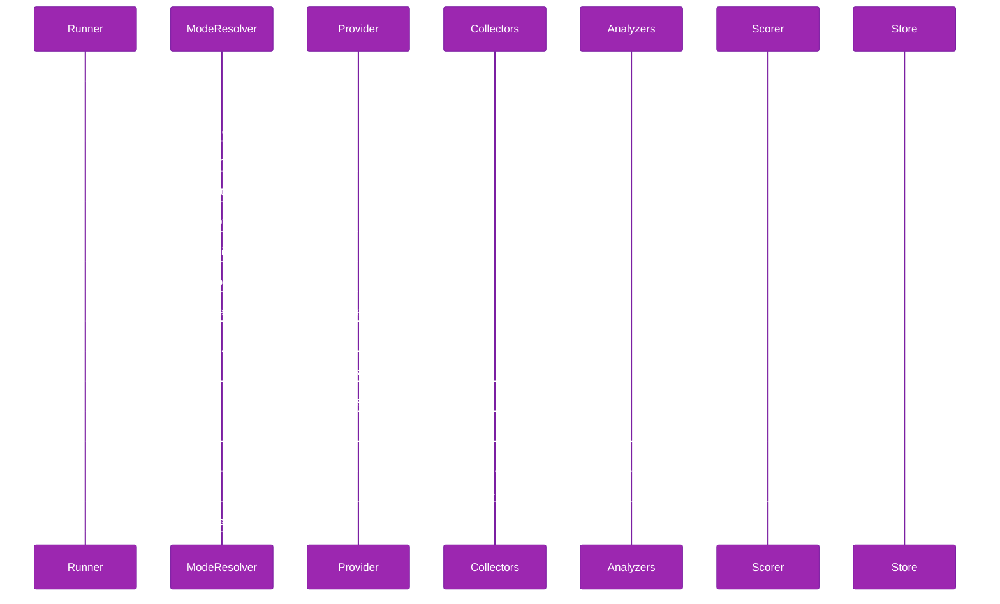

# Profile Runner

Understand how the runner expands the mode x scenario x repetition matrix and manages iteration lifecycles.

## Iteration Lifecycle



## Input Validation

Before expanding the matrix, `runProfileSuite` validates the configuration:

- `repetitions` must be >= 1 (throws if zero or negative)
- `allowedRetries` must be >= 0 (throws if negative)

These checks run before any provider initialization, so invalid configurations fail fast with clear error messages.

## Matrix Expansion

The runner expands the profile configuration into a flat execution matrix of `modes x scenarios x repetitions`. Given a configuration with 2 modes, 3 scenarios, and 5 repetitions, the runner executes 30 iterations total.

The expansion order is:

1. Outer loop: **modes** (sequential)
2. Middle loop: **scenarios** (sequential within a mode)
3. Inner loop: **repetitions** (sequential within a scenario)

`Provider.init()` is called once per suite before the mode loop begins; `Provider.shutdown()` is called once after all modes complete. This ordering ensures all repetitions of a scenario complete before moving to the next scenario.

```typescript
// Conceptual expansion (not actual source)
await provider.init(config)

try {
  for (const mode of config.modes) {
    const modeConfig = await modeResolver.resolve(mode)

    for (const scenario of config.scenarios) {
      for (let i = 0; i < config.repetitions; i++) {
        await runIteration(provider, scenario, mode, i)
      }
    }
  }
} finally {
  // shutdown is wrapped in try/finally to ensure cleanup even on failure
  await provider.shutdown()
}
```

## Warmup

The runner supports an optional canary iteration that runs before the main suite. The warmup uses the first mode and first scenario with `iteration = -1`. This serves two purposes:

1. **Provider validation** -- confirms the provider initializes, creates sessions, and responds to prompts without errors before committing to the full matrix.
2. **Cache priming** -- warms up any provider-side caches or connection pools so the first real iteration does not carry cold-start overhead.

The warmup is enabled by default (`DEFAULT_WARMUP: true`). Set `warmup: false` in the profile YAML to disable it.

Source: `packages/agent-profiler/src/runner/warmup.ts`

## Retry Logic

Each iteration supports a configurable number of retries controlled by `allowedRetries` in the profile configuration (default: 0, meaning no retries).

When an iteration fails:

1. The runner destroys the failed session via `Provider.destroySession()`.
2. A new session is created via `Provider.createSession()` for the retry attempt.
3. The retry counter increments and the iteration re-executes from the prompt step.
4. If all retry attempts exhaust, the runner writes a `ProfileRow` with the error field populated.

Each retry creates a fresh session to avoid state contamination from the failed attempt.

Source: `packages/agent-profiler/src/runner/iteration.ts`

## Hook Invocation Order

The runner invokes hooks at well-defined points in the execution lifecycle. All hooks are optional.

```text
beforeRun(ctx)
  beforeMode(mode)
    beforeScenario(ctx)     // per-iteration
      iteration (prompt -> export -> collect -> analyze -> score -> write)
    afterScenario(ctx)      // per-iteration, called even on failure
  afterMode(mode)
afterRun(ctx)
```

The full invocation order:

| Hook | When | Argument |
|------|------|----------|
| `beforeRun` | Once, before any mode starts | `RunContext` |
| `beforeMode` | Before each mode's first scenario | `mode: string` |
| `beforeScenario` | Before each iteration (per-scenario, per-repetition) | `BeforeScenarioContext` |
| `afterScenario` | After each iteration completes (per-scenario, per-repetition) | `AfterScenarioContext` |
| `afterMode` | After all scenarios in a mode complete | `mode: string` |
| `afterRun` | Once, after all modes complete | `RunContext` |

The `afterScenario` hook fires even when the iteration fails. The `AfterScenarioContext` includes the `result` field (a `ProfileRow` with the error) and `trace` (null on failure) so hooks can react to failures.

## ProfileSuiteResult

After the full matrix completes, `runProfileSuite()` returns a `ProfileSuiteResult`:

```typescript
interface ProfileSuiteResult {
  readonly runId: string
  readonly rows: readonly ProfileRow[]
  readonly durationMs: number
  readonly outputJsonlPath: string
  readonly analysisResults: readonly SessionAnalysisBundle[]
}
```

| Field | Description |
|-------|-------------|
| `runId` | Unique identifier for the suite execution |
| `rows` | All `ProfileRow` objects written during the suite |
| `durationMs` | Total wall-clock time for the suite |
| `outputJsonlPath` | Absolute path to the JSONL results file |
| `analysisResults` | Aggregated analysis results from all iterations |

Source: `packages/agent-profiler/src/runner/profile-runner.ts`

## Related Documentation

- [System Overview](./overview.md)
- [Plugin Contracts](./plugin-contracts.md)
- [Built-in Collectors](./built-in-collectors.md)
- [Built-in Analyzers](./built-in-analyzers.md)
- [Statistics Engine](./statistics.md)
