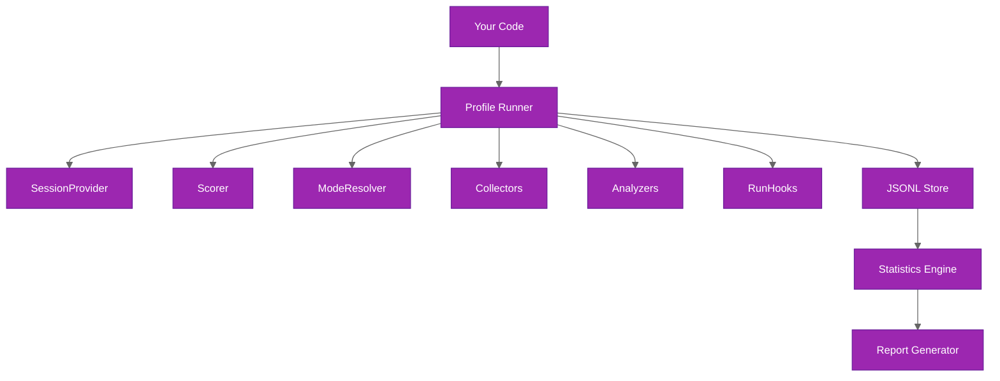

# Core Concepts

Understand the mental model, plugin-first architecture, and how `@ghx-dev/agent-profiler` differs from eval frameworks.

## Eval vs Profiler

Eval frameworks and profilers solve related but distinct problems. An eval asks "did the agent succeed?" A profiler asks "how efficiently did it succeed, and why?"

| Concern | Eval Framework | Agent Profiler |
|---------|---------------|----------------|
| Primary question | Did it work? | How efficiently did it work, and why? |
| Checkpoints | Pass/fail assertions | Pass/fail via pluggable Scorer |
| Token tracking | Not measured | Per-category breakdown (input, output, reasoning, cache) |
| Latency tracking | Not measured | Wall-clock timing with segment breakdowns |
| Cost tracking | Not measured | USD breakdown by token category |
| Behavioral analysis | Not measured | Structured findings from 5 built-in analyzers |
| Statistical rigor | Single-run pass/fail | Bootstrap CI, Cohen's d, permutation tests across repetitions |
| Cross-mode comparison | Manual | Automated with confidence intervals and effect sizes |

Agent profiler does not replace evals. It complements them by adding the efficiency dimension that evals leave unmeasured.

## Plugin-First Architecture

The profiler is designed around six plugin contracts. You implement the three that connect to your agent (Provider, Scorer, ModeResolver), and the framework provides built-in implementations for the rest.

**You implement:**

- **SessionProvider** -- drives agent sessions: create, prompt, export, and destroy. This is the primary integration point where you connect the profiler to your agent runtime.
- **Scorer** -- evaluates agent output against scenario-specific checkpoints. Returns a pass/fail result with an optional numeric score.
- **ModeResolver** -- maps mode names (e.g., `"baseline"`, `"optimized"`) to environment variables and system instructions that configure the agent differently for each mode.

**Built-in:**

- **Collectors** -- extract structured metrics from each `PromptResult`. Four ship out of the box: `TokenCollector`, `LatencyCollector`, `CostCollector`, and `ToolCallCollector`.
- **Analyzers** -- produce structured findings from full `SessionTrace` data. Five built-in analyzers cover reasoning, strategy, efficiency, tool patterns, and errors.
- **RunHooks** -- optional lifecycle callbacks at run, mode, and iteration boundaries. Useful for logging, cleanup, or external integrations.

The runner orchestrates everything. It calls your plugins at the right time, feeds results through collectors and analyzers, writes raw data to JSONL, and hands the dataset to the statistics engine and report generator.

## Data Flow

The profiler pipeline moves data through five stages:

1. **Configuration** -- you provide modes, scenarios, repetitions, and plugin instances via `ProfileSuiteOptions`.

2. **Matrix expansion** -- the runner expands the configuration into a full iteration matrix of mode x scenario x repetition.

3. **Iteration execution** -- for each iteration, the runner:
   - Calls `ModeResolver` to get mode-specific configuration
   - Calls `SessionProvider.createSession` to start an agent session
   - Calls `SessionProvider.prompt` with the scenario prompt and collects a `PromptResult`
   - Passes the `PromptResult` through each `Collector` to extract `CustomMetrics`
   - Calls `Scorer` to evaluate checkpoints
   - Calls `SessionProvider.exportSession` to get a `SessionTrace`
   - Passes the trace through each `Analyzer` to produce findings
   - Writes a `ProfileRow` to the JSONL store

4. **Statistical analysis** -- the statistics engine reads all `ProfileRow` records and computes descriptive statistics (mean, median, p90, p95, IQR, CV, stddev), bootstrap confidence intervals, Cohen's d effect sizes, and permutation tests.

5. **Report generation** -- the report generator produces multi-page Markdown reports, CSV exports, and aggregated summary JSON.

## Key Types

| Type | Purpose |
|------|---------|
| `ProfileRow` | The full data record for one iteration, containing scenario metadata, mode, metrics from all collectors, scorer results, and analyzer findings. This is the fundamental unit of storage. |
| `BaseScenario` | A scenario definition with id, name, description, prompt, timeout, retry policy, tags, and an extensions map for custom data. |
| `PromptResult` | The raw metrics returned by a `SessionProvider.prompt` call: text output, token breakdown, timing breakdown, tool call records, cost breakdown, and completion reason. |
| `SessionTrace` | The full event trace from an agent session, including all events, turns, and a summary with aggregate token and duration totals. |
| `ProfileSuiteResult` | The return value of `runProfileSuite`, containing all `ProfileRow` records, computed statistics, and metadata about the run. Pass this to `generateReport` to produce output. |

## Source Reference

- Plugin contracts: `packages/agent-profiler/src/contracts/`
- Built-in collectors: `packages/agent-profiler/src/collector/`
- Built-in analyzers: `packages/agent-profiler/src/analyzer/`
- Statistics engine: `packages/agent-profiler/src/stats/`
- Report generator: `packages/agent-profiler/src/reporter/`

## Related Documentation

- [Installation](installation.md) -- prerequisites and package setup
- [Quick Start](quick-start.md) -- complete runnable example
- [Architecture Overview](../architecture/README.md) -- detailed system design
- [Plugin Contracts](../architecture/plugin-contracts.md) -- full interface definitions for all six contracts
