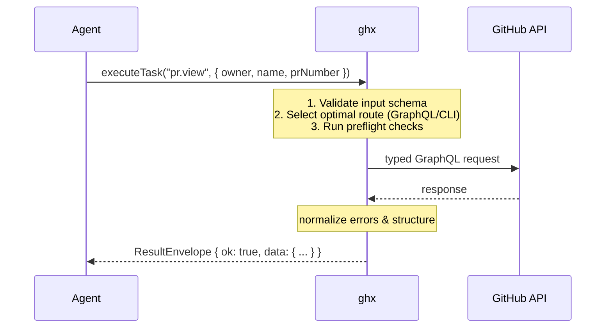

<h1 align="center">@ghx-dev/core</h1>

<p align="center">
  
</p>

<p align="center">
  A typed GitHub execution router that gives AI agents deterministic, token-efficient access to the GitHub API.
</p>

[](https://www.npmjs.com/package/@ghx-dev/core)
[](https://www.npmjs.com/package/@ghx-dev/core)
[](https://github.com/aryeko/ghx/actions/workflows/ci-main.yml)
[](https://codecov.io/gh/aryeko/ghx)
[](https://github.com/aryeko/ghx/blob/main/LICENSE)

## Why ghx?

When AI agents use the `gh` CLI directly, they waste thousands of tokens on research, trial-and-error formatting, and guessing JSON parsing paths. **ghx eliminates this waste** by providing a stable, structured execution layer.

> **100% success rate, 73% fewer tool calls, 18% fewer active tokens, 54% lower latency** compared to raw CLI usage ([measured across 30 runs](https://github.com/aryeko/ghx/blob/main/docs/eval-report.md) on standard PR workflows with Codex 5.3).



## Features

- **70+ Declarative Capabilities**: PRs, issues, labels, workflows, projects, releases — all defined by versioned YAML operation cards.
- **Deterministic Routing**: The agent doesn't choose CLI vs. GraphQL. ghx evaluates suitability rules and picks the optimal route automatically, with built-in fallbacks.
- **Stable Result Envelope**: No try/catch needed. Every execution returns `{ ok, data, error, meta }`. Errors are mapped to standard codes (`AUTH`, `RATE_LIMIT`, `NOT_FOUND`, etc.).
- **Chaining & Batching**: Execute multiple steps (`add label`, `add assignee`, `comment`) in one call. ghx resolves node IDs and batches them into a single network request.
- **Type Safety**: Full TypeScript schemas for inputs and outputs (via generated GraphQL types).

## Documentation

Comprehensive documentation is available in the [`docs/`](./docs/) directory:

- **[Getting Started](./docs/getting-started/README.md)** — Installation, why ghx, and use case diagrams.
  - [Library Quickstart](./docs/getting-started/library-quickstart.md)
  - [CLI Quickstart](./docs/getting-started/cli-quickstart.md)
  - [Agent Setup](./docs/getting-started/agent-setup.md)
- **[Concepts](./docs/concepts/README.md)** — How ghx works internally (Routing Engine, Operation Cards, Result Envelope, Chaining).
- **[Architecture](./docs/architecture/README.md)** — System design, execution pipeline, formatters, and GraphQL layer.
- **[Reference](./docs/reference/README.md)** — API exports, error codes, and a complete table of all 70+ capabilities.

## Install

```bash
npm i -g @ghx-dev/core
```

This makes the `ghx` CLI available in your PATH. Then wire it into your agent (see [Agent Integration](#agent-integration) below).

For library usage (TypeScript imports), install as a project dependency instead:

```bash
npm install @ghx-dev/core
```

## Quick Start (Library)

```ts
import { createGithubClientFromToken, executeTask } from "@ghx-dev/core"

const token = process.env.GITHUB_TOKEN!
const githubClient = createGithubClientFromToken(token)

// Execute a task: input is validated, optimal route is chosen
const result = await executeTask(
  { task: "repo.view", input: { owner: "aryeko", name: "ghx" } },
  { githubClient, githubToken: token },
)

if (result.ok) {
  console.log("Success:", result.data.nameWithOwner)
  console.log("Route used:", result.meta.route_used) // e.g. "graphql"
} else {
  console.error("Failed:", result.error.code) // e.g. "NOT_FOUND"
  console.error("Retryable?", result.error.retryable)
}
```

## Quick Start (CLI)

Use ghx directly from your terminal or add it as an agent skill.

```bash
# List all 70+ capabilities
ghx capabilities list

# Run a capability
ghx run pr.view --input '{"owner":"aryeko","name":"ghx","prNumber":42}'

# Output is a standard ResultEnvelope:
# {
#   "ok": true,
#   "data": { ... },
#   "meta": { "capability_id": "pr.view", "route_used": "graphql", ... }
# }
```

## Agent Integration

**Claude Code** -- install from the plugin marketplace:

```bash
claude plugin add ghx
```

**Cursor, Windsurf, Codex, other agents** -- install the skill:

```bash
ghx setup --scope user --yes
```

This writes `SKILL.md` to `~/.agents/skills/using-ghx/` which teaches your agent how to use `ghx` for reliable GitHub interactions. See [Agent Setup](./docs/getting-started/agent-setup.md) for platform-specific wiring.

## License

MIT
