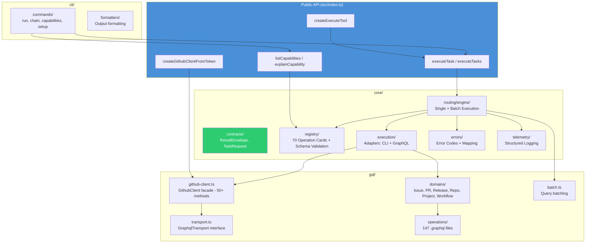
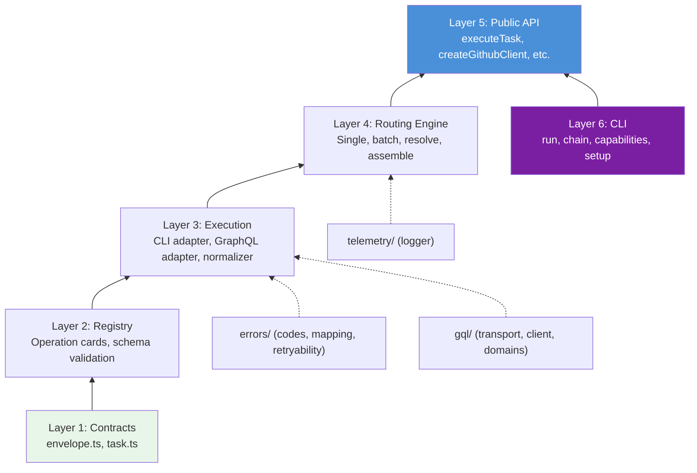

# Architecture

System-level view of `@ghx-dev/core` — how the modules fit together and the dependency flow between them.

## Component Diagram



## Module Dependency Layers



## Key Design Decisions

| Decision | Rationale |
|---|---|
| **Cards are YAML, not code** | Declarative, diffable, easy for non-TS contributors to modify |
| **Registry loads all cards at startup** | Zero cold-start latency per request |
| **GraphQL preferred by default** | More efficient, typed, batches well |
| **CLI as fallback** | Some operations (diffs, raw logs) are only available via CLI |
| **Preflight check before each route** | Fail fast — don't attempt GraphQL without a token |
| **Resolution phase in batch mode** | Reduce N lookups to 1 batched query |
| **Error normalization** | Every adapter maps raw errors to the same `ErrorCode` set |

## Source Layout

```
src/
├── index.ts              Public API re-exports
├── core/
│   ├── contracts/        ResultEnvelope, TaskRequest
│   ├── registry/         Operation cards + schema validation
│   │   └── cards/        70 YAML operation card files
│   ├── routing/          Route selection + execution engine
│   │   └── engine/       single.ts, batch.ts, resolve.ts, assemble.ts
│   ├── execution/        Adapter implementations
│   │   └── adapters/     cli-adapter.ts, graphql-adapter.ts
│   ├── errors/           Error codes, mapping, retryability
│   ├── execute/          Execute orchestration layer
│   └── telemetry/        Structured logging
├── gql/
│   ├── transport.ts      GraphqlTransport interface
│   ├── github-client.ts  GithubClient facade
│   ├── domains/          Domain-specific GQL handlers
│   ├── operations/       .graphql operation files
│   └── batch.ts          Query batching utilities
├── cli/
│   ├── commands/         CLI command implementations
│   └── formatters/       Output formatting
└── shared/               Constants, types, utils
```

## Deep Dives

- [Execution Pipeline](./execution-pipeline.md) — step-by-step walkthrough of how a single task executes
- [Adapters](./adapters.md) — CLI and GraphQL adapter internals
- [GraphQL Layer](./graphql-layer.md) — transport, client facade, codegen, batching
