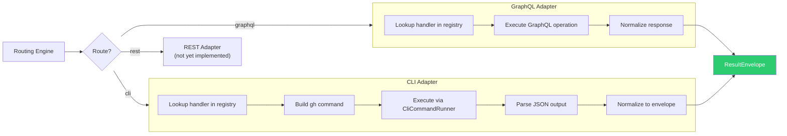

# Adapters

Adapters are the bridge between the routing engine and the actual GitHub APIs. ghx ships two adapters: **GraphQL** and **CLI**. Each converts a generic `(capabilityId, params)` call into a route-specific API call and normalizes the result into a `ResultEnvelope`.

## Adapter Dispatch Flow



## GraphQL Adapter

**Entry point**: `runGraphqlCapability(client, capabilityId, params)`

### How It Works

1. **Handler lookup** — the `gql/capability-registry.ts` maps each `capability_id` to a generated handler function in the `gql/domains/` module
2. **Execution** — the handler calls `GithubClient` methods (e.g. `client.fetchPrView(params)`) which send typed GraphQL queries
3. **Normalization** — the raw response is wrapped in a `ResultEnvelope` with `route_used: "graphql"`
4. **Error mapping** — GraphQL errors are mapped to `ErrorCode` values via `mapErrorToCode`

### Error Mapping

| GraphQL error pattern | Mapped `ErrorCode` |
|---|---|
| `"Could not resolve"` | `NOT_FOUND` |
| `"Bad credentials"` | `AUTH` |
| `"rate limit"` | `RATE_LIMIT` |
| `"Resource not accessible"` | `FORBIDDEN` |
| Network/timeout errors | `NETWORK` |
| Everything else | `UNKNOWN` |

## CLI Adapter

**Entry point**: `runCliCapability(runner, capabilityId, params, card)`

### How It Works

1. **Handler lookup** — `cli/capability-registry.ts` maps each `capability_id` to a CLI handler function
2. **Command building** — the handler constructs the `gh` command from `card.cli.command`, params, and any `--json` fields
3. **Execution** — the `CliCommandRunner` interface executes the command:
    ```ts
    interface CliCommandRunner {
      (args: string[]): Promise<{ stdout: string; stderr: string; exitCode: number }>
    }
    ```
4. **JSON parsing** — stdout is parsed as JSON
5. **Field extraction** — if `card.cli.jsonFields` is set, only those fields are extracted
6. **JQ transform** — if `card.cli.jq` is set, a jq-like filter is applied
7. **Normalization** — result wrapped in `ResultEnvelope` with `route_used: "cli"`

### Custom CLI Runner

You can provide your own `CliCommandRunner` for testing or sandboxing:

```ts
import { createSafeCliCommandRunner, executeTask } from "@ghx-dev/core"

const runner = createSafeCliCommandRunner() // default safe runner
const result = await executeTask(
  { task: "pr.view", input: { owner: "acme", name: "repo", number: 42 } },
  { githubClient, githubToken: token, cliRunner: runner },
)
```

## Supported Capabilities per Adapter

Most capabilities support both adapters. Some are one-adapter-only:

| Adapter | Unique capabilities |
|---|---|
| **CLI only** | `pr.diff.view` (raw diff), `workflow.job.logs.raw` |
| **GraphQL only** | Various mutation-only operations without CLI equivalents |

The routing engine handles this transparently — if a card only has a `cli` block, only CLI is attempted.

## Key Source Files

| File | Role |
|---|---|
| `core/execution/adapters/graphql-capability-adapter.ts` | GraphQL adapter entry |
| `core/execution/adapters/cli-capability-adapter.ts` | CLI adapter entry |
| `core/execution/adapters/cli-adapter.ts` | `CliCommandRunner` type |
| `core/execution/adapters/cli/` | Per-capability CLI handlers |
| `core/execution/normalizer.ts` | `normalizeResult` / `normalizeError` |
| `gql/capability-registry.ts` | GraphQL handler registry |

## Next Steps

- [GraphQL Layer](./graphql-layer.md) — transport, client facade, codegen
- [Execution Pipeline](./execution-pipeline.md) — how adapters fit into the full pipeline
- [Adding a Capability](../guides/adding-a-capability.md) — write your own adapter handler
