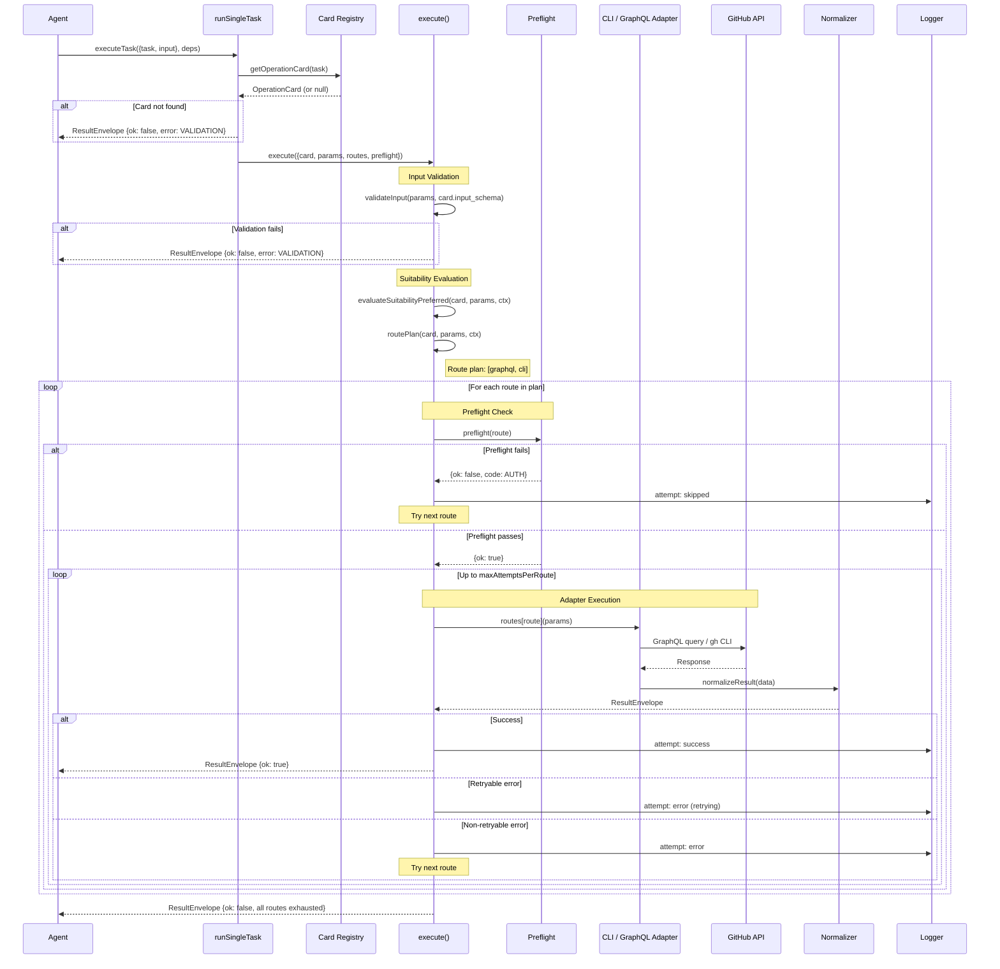

# Execution Pipeline

This page walks through the complete lifecycle of a single `executeTask` call — from the moment your agent sends a request to the moment it receives a `ResultEnvelope`.

## Sequence Diagram



## Step-by-Step

### 1. Card Lookup (`runSingleTask`)

```ts
const card = getOperationCard(task)
if (!card) → return VALIDATION error
```

The registry preloads all 70 YAML cards at startup, so this is a synchronous map lookup.

### 2. Input Validation

The engine validates `params` against `card.input_schema` using AJV:

```ts
validateInput(params, card.input_schema)
```

Invalid input → immediate `VALIDATION` error with schema details.

### 3. Suitability Evaluation

Checks if any suitability rules override the card's preferred route:

```ts
const effectivePreferred = evaluateSuitabilityPreferred(card, params, routingContext)
```

The `routingContext` includes:
- `ghCliAvailable` — is `gh` installed?
- `ghAuthenticated` — is `gh` authenticated?
- `githubTokenPresent` — is a token available?

### 4. Route Planning

Builds the ordered attempt list:

```ts
const plan = routePlan(card, params, routingContext)
// e.g. ["graphql", "cli"]
```

### 5. Preflight → Execute → Retry Loop

For each route in the plan:

1. **Preflight** — check prerequisites (token, CLI availability)
2. **Adapter call** — dispatch to the route's adapter
3. **Output validation** — optionally validate against `card.output_schema`
4. **Retry** — on retryable errors, retry up to `maxAttemptsPerRoute`
5. **Fallback** — on non-retryable error or max retries, try the next route

### 6. Telemetry

Every step is logged with structured telemetry:

```
execute.start       { capability_id: "pr.view" }
execute.complete    { capability_id: "pr.view", ok: true, route_used: "graphql", duration_ms: 120 }
```

## Key Source Files

| File | Role |
|---|---|
| `core/routing/engine/single.ts` | Entry point for single task execution |
| `core/execute/execute.ts` | Core execute loop (suitability, route plan, retry) |
| `core/execution/preflight.ts` | Preflight checks per route |
| `core/execution/normalizer.ts` | Normalizes results and errors into envelope shape |
| `core/registry/schema-validator.ts` | AJV-based input/output validation |

## Next Steps

- [Adapters](./adapters.md) — how CLI and GraphQL adapters work internally
- [Routing Engine Concepts](../concepts/routing-engine.md) — the why behind routing
