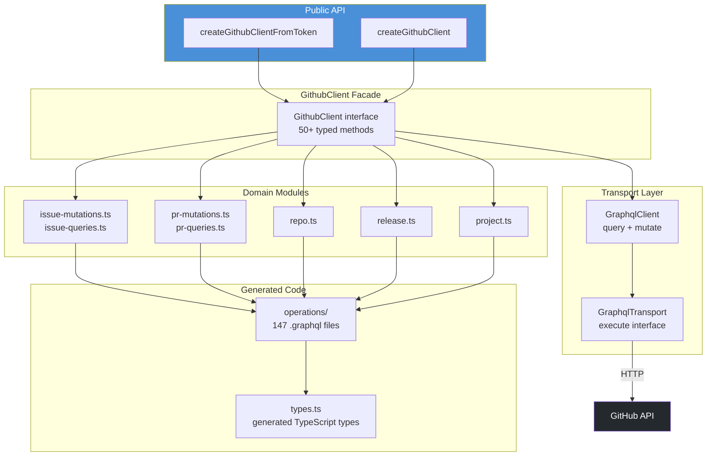

# GraphQL Layer

The `gql/` module provides the typed GraphQL infrastructure that powers ghx's preferred execution route — from the raw transport interface to the high-level `GithubClient` facade.

## Stack Overview



## Transport Interface

The lowest layer — a single `execute` method that sends a GraphQL query and returns typed data:

```ts
interface GraphqlTransport {
  execute<TData>(query: string, variables?: Record<string, unknown>): Promise<TData>
}
```

`createGraphqlClient(transport)` wraps this into a `GraphqlClient` with `query()` and `mutate()` methods.

**Default transport**: `createTokenTransport(token, endpoint?)` — uses `graphql-request` to send queries to GitHub's GraphQL API.

## GithubClient Facade

The `GithubClient` interface provides 50+ typed methods, one per GitHub operation:

```ts
interface GithubClient {
  fetchRepoView(input: RepoViewInput): Promise<RepoViewData>
  fetchIssueList(input: IssueListInput): Promise<IssueListData>
  createIssue(input: IssueCreateInput): Promise<IssueMutationData>
  submitPrReview(input: PrReviewSubmitInput): Promise<PrReviewSubmitData>
  // ... 50+ more methods
  query(document: string, variables?: Record<string, unknown>): Promise<unknown>
}
```

Each method:
1. Maps typed input → GraphQL variables
2. Sends the appropriate `.graphql` operation
3. Extracts and returns typed output

The `query()` method provides raw GraphQL access for batch operations and lookups.

## Domain Modules

Domain modules group related GraphQL operations by entity:

| Module | Capabilities |
|---|---|
| `issue-queries.ts` | Issue view, list, comments list, linked PRs, relations |
| `issue-mutations.ts` | Create, update, close, reopen, delete, labels, assignees, milestones, parent, blockers |
| `pr-queries.ts` | PR view, list, diff files, threads, reviews, checks, merge status |
| `pr-mutations.ts` | Create, update, merge, review submit, thread resolve, branch update |
| `repo.ts` | Repo view, labels list, issue types |
| `release.ts` | Release CRUD, publish |
| `project.ts` | Project V2 views, items, fields |

Each module exports factory functions that create typed handlers from the `GithubClient`.

## GraphQL Codegen

Operations are authored as `.graphql` files in `gql/operations/` and processed through a codegen pipeline:

```bash
# Refresh the GitHub schema (requires GITHUB_TOKEN)
pnpm run gql:schema:refresh

# Generate TypeScript types and operation documents
pnpm run gql:generate

# Verify generated code is in sync
pnpm run gql:verify
```

The pipeline uses `@graphql-codegen/cli` with:
- `typescript` plugin — generates base types from the GitHub schema
- `typescript-operations` — generates per-operation input/output types
- `near-operation-file-preset` — co-locates generated types near their `.graphql` files

## Batch Query Building

For chained operations, `batch.ts` provides utilities to combine multiple GraphQL operations into a single request using aliases:

```ts
const { document, variables } = buildBatchQuery([
  { alias: "step0", query: issueViewQuery, variables: { owner: "acme", ... } },
  { alias: "step1", query: prViewQuery, variables: { owner: "acme", ... } },
])
// Sends one request, results keyed by alias
```

## Custom Transport

For enterprise endpoints, proxies, or testing, bring your own transport:

```ts
import { createGithubClient } from "@ghx-dev/core"

const githubClient = createGithubClient({
  async execute<TData>(query: string, variables?: Record<string, unknown>): Promise<TData> {
    const res = await fetch("https://github.mycompany.com/api/graphql", {
      method: "POST",
      headers: {
        "content-type": "application/json",
        authorization: `Bearer ${process.env.GITHUB_TOKEN}`,
      },
      body: JSON.stringify({ query, variables }),
    })
    const payload = (await res.json()) as { data?: TData; errors?: Array<{ message?: string }> }
    if (payload.errors?.length) throw new Error(payload.errors[0]?.message ?? "GraphQL error")
    return payload.data!
  },
})
```

→ Full guide: [Custom GraphQL Transport](../guides/custom-graphql-transport.md)

## Key Source Files

| File | Role |
|---|---|
| `gql/transport.ts` | `GraphqlTransport` interface + `createGraphqlClient` |
| `gql/github-client.ts` | `GithubClient` facade (50+ methods) |
| `gql/capability-registry.ts` | Maps capability IDs to GQL handlers |
| `gql/batch.ts` | Batch query building + alias extraction |
| `gql/domains/` | Domain-specific handler factories |
| `gql/operations/` | 147 `.graphql` operation files |

## Next Steps

- [Adapters](./adapters.md) — how the GraphQL adapter uses this layer
- [Custom GraphQL Transport Guide](../guides/custom-graphql-transport.md) — detailed setup
