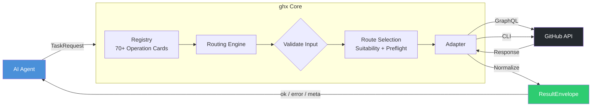

# How ghx Works

ghx is a **typed execution router** — it sits between your AI agent and the GitHub API, providing deterministic routing, input validation, and a stable response contract.

## The Big Picture



## Core Design Decisions

### 1. Operation Cards — Not Hardcoded Logic

Every capability (e.g. `pr.view`, `issue.labels.add`) is defined by a **YAML operation card**, not imperative code. Cards declare:
- Input/output JSON schemas
- Preferred route (GraphQL or CLI)
- Fallback routes
- Suitability rules (when to prefer one route over another)

→ [Operation Cards deep dive](./operation-cards.md)

### 2. Deterministic Routing — Not Agent Guesswork

The agent never chooses between `gh` CLI, GraphQL, or REST. The routing engine reads the card's routing config, evaluates environment suitability, runs preflight checks, and picks the optimal path automatically.

→ [Routing Engine deep dive](./routing-engine.md)

### 3. Stable Envelope — Not Raw API Payloads

Every result — success or failure — is wrapped in a `ResultEnvelope`:

```ts
{ ok: boolean, data?: T, error?: ResultError, meta: ResultMeta }
```

Your agent always gets the same shape. No parsing surprises.

→ [Result Envelope deep dive](./result-envelope.md)

### 4. Batch Execution — Not N+1 Calls

Multiple operations can be batched into a single `executeTasks` call. ghx classifies each step, resolves node IDs via Phase 1 lookups, batches GraphQL operations, and assembles results — all transparently.

→ [Chaining deep dive](./chaining.md)

## Module Map

| Module | Purpose |
|---|---|
| `core/contracts/` | `ResultEnvelope`, `TaskRequest` — the API contract |
| `core/registry/` | 70 YAML operation cards + schema validation |
| `core/routing/` | Route selection engine (single + batch) |
| `core/execution/` | CLI and GraphQL adapters |
| `core/errors/` | Error codes, mapping, retryability |
| `core/telemetry/` | Structured logging |
| `gql/` | GraphQL transport, client facade, domain modules |
| `cli/` | CLI commands (`run`, `chain`, `capabilities`, `setup`) |

→ [Architecture deep dive](../architecture/README.md)
