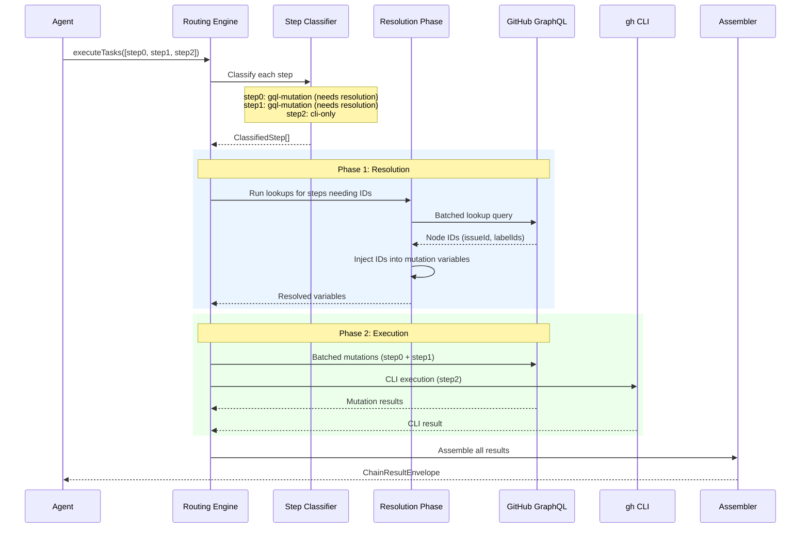

# Chaining: Batch Operations

ghx can batch multiple operations into a single logical call with `executeTasks`. Internally, the engine classifies, resolves, batches, and assembles — turning N operations into as few network requests as possible.

## Quick Example

```ts
const chain = await executeTasks(
  [
    { task: "issue.labels.remove", input: { owner: "acme", name: "repo", issueNumber: 7, labels: ["triage"] } },
    { task: "issue.labels.add", input: { owner: "acme", name: "repo", issueNumber: 7, labels: ["bug"] } },
    { task: "issue.comments.create", input: { owner: "acme", name: "repo", issueNumber: 7, body: "Triaged." } },
  ],
  { githubClient, githubToken: token },
)

// chain.status === "success"
// chain.meta.total === 3, chain.meta.succeeded === 3
```

## How Chaining Works



## Step Classification

The engine classifies each step based on the operation card:

| Classification | Criteria | Execution path |
|---|---|---|
| `gql-query` | Card has `graphql` block, `operationType: "query"` | Batched GraphQL query |
| `gql-mutation` | Card has `graphql` block, `operationType: "mutation"` | Batched GraphQL mutation |
| `cli` | Card has no `graphql` block, or GraphQL adapter not available | Individual CLI execution |

## Resolution Phase (Phase 1)

Many mutations require **node IDs** that the caller doesn't have. For example, `issue.labels.add` needs label node IDs, but the agent provides human-readable label names.

The resolution phase:

1. **Identifies** which steps need lookups (via `card.graphql.resolution`)
2. **Batches** all lookups into a single GraphQL query
3. **Injects** resolved IDs into mutation variables

### Inject Types

| Source | Description | Example |
|---|---|---|
| `scalar` | Extract one value from lookup result via dot-path | `repository.issue.id` → `issueId` |
| `map_array` | Map names to IDs from a list | Label names → label node IDs |
| `input` | Pass a value directly from input (no lookup) | `issueId` already provided |
| `null_literal` | Inject `null` explicitly | Clear a milestone |

### Resolution Cache

When the same lookup is needed for multiple steps (e.g. same issue in multiple operations), the engine caches Phase 1 results to avoid redundant queries:

```ts
const deps = {
  githubClient,
  githubToken: token,
  resolutionCache: createResolutionCache(),  // optional
}
```

## Result Assembly

After execution, the assembler:

1. Maps each step result (GQL alias or CLI result) back to the original request
2. Normalizes errors with proper error codes
3. Computes aggregate status (`success` / `partial` / `failed`)
4. Reports `route_used` as `"graphql"` unless every step was CLI

## Next Steps

- [Operation Cards — Resolution Config](./operation-cards.md#resolution-advanced)
- [Execution Pipeline](../architecture/execution-pipeline.md) — lower-level internals
- [API Reference: executeTasks](../reference/api.md)
