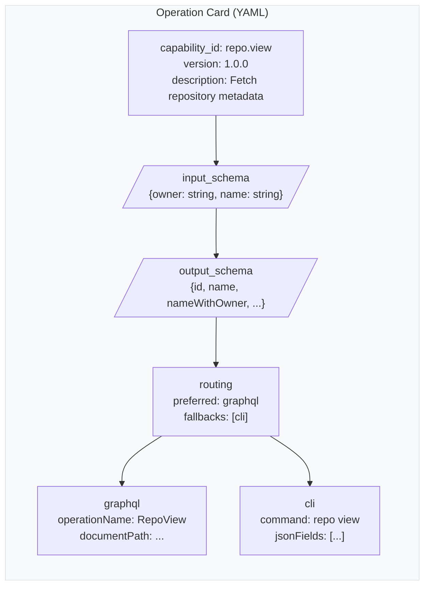

# Operation Cards

Operation cards are the declarative backbone of ghx. Every capability — from viewing a repo to merging a PR — is defined by a YAML file that tells the engine *what* to do, not *how*.

## Why Cards?

| Problem | Card Solution |
|---|---|
| Hardcoded API logic is brittle | Cards are data — easy to version, diff, review |
| Agent needs to know API surface | Card declares input/output schemas |
| Route selection varies by environment | Card declares preferred + fallback routes |
| Adding capabilities means writing code | Adding a card is mostly YAML |

## Anatomy of a Card



## Real Example: `repo.view`

```yaml
capability_id: repo.view
version: "1.0.0"
description: Fetch repository metadata.

input_schema:
  type: object
  required: [owner, name]
  properties:
    owner: { type: string, minLength: 1 }
    name: { type: string, minLength: 1 }
  additionalProperties: false

output_schema:
  type: object
  required: [id, name, nameWithOwner, isPrivate, url, defaultBranch]
  properties:
    id: { type: string, minLength: 1 }
    name: { type: string, minLength: 1 }
    nameWithOwner: { type: string, minLength: 1 }
    isPrivate: { type: boolean }
    stargazerCount: { type: integer, minimum: 0 }
    forkCount: { type: integer, minimum: 0 }
    url: { type: string, minLength: 1 }
    defaultBranch: { type: [string, "null"] }
  additionalProperties: false

routing:
  preferred: graphql
  fallbacks: [cli]

graphql:
  operationName: RepoView
  operationType: query
  documentPath: src/gql/operations/repo-view.graphql

cli:
  command: repo view
  jsonFields: [id, name, nameWithOwner, isPrivate, stargazerCount, forkCount, url, defaultBranchRef]
```

## Card Fields Reference

### Identity

| Field | Description |
|---|---|
| `capability_id` | Dotted ID (e.g. `issue.labels.add`). Used in `executeTask` |
| `version` | SemVer string. Tracks schema changes |
| `description` | Human-readable one-liner |

### Schemas

- **`input_schema`** — JSON Schema for input validation (validated at runtime via AJV)
- **`output_schema`** — JSON Schema for output shape (used for validation and documentation)

### Routing

| Field | Description |
|---|---|
| `routing.preferred` | Primary route: `"graphql"`, `"cli"`, or `"rest"` |
| `routing.fallbacks` | Ordered fallback routes if preferred fails |
| `routing.suitability` | Rules that override preferred route based on environment or params |
| `routing.notes` | Human-readable routing notes |

### Adapter Configs

**GraphQL block:**

| Field | Description |
|---|---|
| `graphql.operationName` | Name of the GraphQL operation |
| `graphql.operationType` | `"query"` or `"mutation"` |
| `graphql.documentPath` | Path to the `.graphql` file |
| `graphql.variables` | Map input fields to GraphQL variables |
| `graphql.resolution` | Phase 1 lookup config for node ID resolution |

**CLI block:**

| Field | Description |
|---|---|
| `cli.command` | `gh` subcommand (e.g. `repo view`) |
| `cli.jsonFields` | Fields to extract from `--json` output |
| `cli.jq` | Optional `jq` filter for output transformation |

### Resolution (Advanced)

Some mutations require node IDs that the caller doesn't have (e.g. label IDs from label names). The `resolution` block configures a Phase 1 lookup:

```yaml
resolution:
  lookup:
    operationName: IssueLookup
    documentPath: src/gql/operations/lookups/issue-lookup.graphql
    vars: { owner: owner, name: name, number: issueNumber }
  inject:
    - target: issueId
      source: scalar
      path: repository.issue.id
    - target: labelIds
      source: map_array
      from_input: labels
      nodes_path: repository.labels.nodes
      match_field: name
      extract_field: id
```

→ See [Chaining](./chaining.md) for how resolution works in batch mode.

## All 70 Cards

Cards are stored in `src/core/registry/cards/`. See the full table: [Capabilities Reference](../reference/capabilities.md).

## Next Steps

- [Routing Engine](./routing-engine.md) — how cards drive route selection
- [Adding a Capability](../guides/adding-a-capability.md) — write your own card
