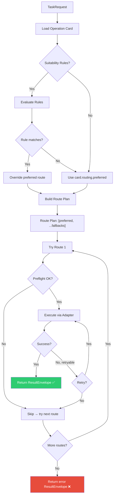

# Routing Engine

The routing engine is the brain of ghx — it decides *how* to execute each capability (GraphQL, CLI, or REST) based on the operation card's routing config and the current environment.

## Route Selection Flow



## Step by Step

### 1. Card Lookup

The engine looks up the operation card for the requested `capability_id` from the registry. If no card exists, it returns a `VALIDATION` error immediately.

### 2. Suitability Evaluation

Some cards define **suitability rules** that override the preferred route based on environment or input parameters:

```yaml
routing:
  preferred: graphql
  fallbacks: [cli]
  suitability:
    - when: params
      predicate: "input.diff == true"
      reason: "Diffs are only available via CLI"
```

Rule types:
- `when: "always"` — always apply
- `when: "env"` — check environment variables
- `when: "params"` — check input parameters

### 3. Route Planning

After suitability evaluation, the engine builds an ordered **route plan**:

```
[effective_preferred, ...card.routing.fallbacks]
```

Duplicates are removed. The engine tries each route in order.

### 4. Preflight Check

Before attempting a route, the engine runs a **preflight check**:

| Route | Preflight checks |
|---|---|
| `graphql` | `GITHUB_TOKEN` is set |
| `cli` | `gh` CLI is installed and authenticated |
| `rest` | (not yet implemented) |

If preflight fails, the route is skipped with `status: "skipped"` in the attempt log.

### 5. Adapter Execution

The route dispatches to the appropriate **adapter**:

- **GraphQL adapter** — looks up the generated handler, executes the query/mutation, normalizes the response
- **CLI adapter** — looks up the CLI handler, runs `gh` with the right flags, parses JSON output

### 6. Retry and Fallback

If the adapter returns a retryable error (`RATE_LIMIT`, `NETWORK`, `SERVER`), the engine retries on the same route (up to `maxAttemptsPerRoute`, default: 2).

If all retries fail, it moves to the next route in the plan.

## Route Reason Codes

Every `ResultEnvelope.meta.reason` tells you *why* a route was chosen:

| Code | Meaning |
|---|---|
| `CARD_PREFERRED` | Used the card's preferred route |
| `CARD_FALLBACK` | Preferred route failed, used a fallback |
| `SUITABILITY_OVERRIDE` | A suitability rule overrode the preferred route |
| `CAPABILITY_LIMIT` | Capability only supports one route |
| `DEFAULT_POLICY` | No card routing — used system default |

## Attempt History

For debugging, `ResultEnvelope.meta.attempts` records every route attempted:

```json
{
  "meta": {
    "attempts": [
      { "route": "graphql", "status": "error", "error_code": "RATE_LIMIT", "duration_ms": 120 },
      { "route": "cli", "status": "success", "duration_ms": 450 }
    ],
    "route_used": "cli",
    "reason": "CARD_FALLBACK"
  }
}
```

## Next Steps

- [Execution Pipeline](../architecture/execution-pipeline.md) — code-level walkthrough
- [Result Envelope](./result-envelope.md) — understanding the output contract
- [Adapters](../architecture/adapters.md) — CLI and GraphQL adapter internals
