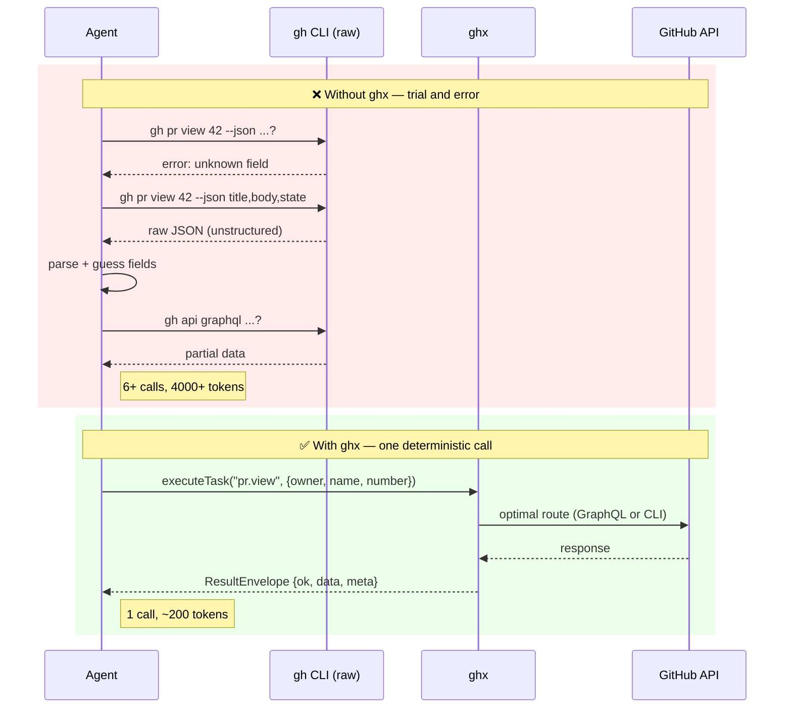
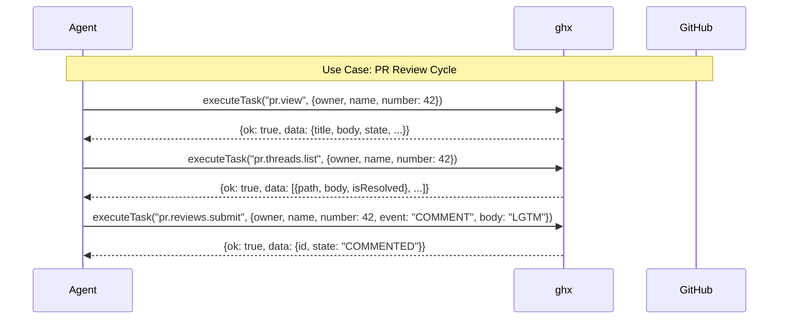
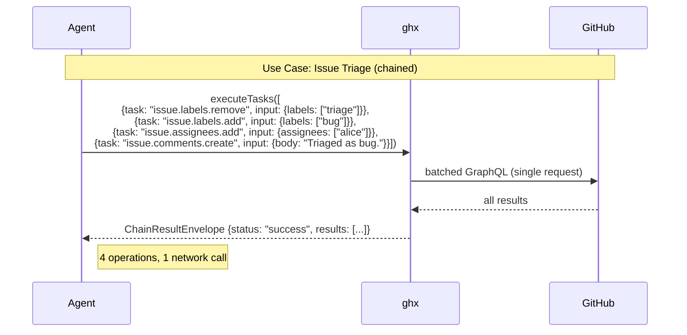

# Getting Started

## Why ghx?

AI agents instructed to "use `gh` CLI" for GitHub operations waste significant tokens on research, trial-and-error, and output parsing. **ghx eliminates this waste.**



### Benchmarked Results

Three-mode comparison (baseline `gh` CLI vs GitHub MCP vs ghx) across [30 runs](https://github.com/aryeko/ghx/blob/main/docs/eval-report.md) with Codex 5.3. All differences statistically significant (p < 0.05, Cohen's d > 0.8).

| Metric | ghx vs baseline |
|---|---|
| Tool calls | **-73%** |
| Active tokens | **-18%** |
| Latency | **-54%** |
| Success rate | **100%** (baseline 90%) |

## Prerequisites

- **Node.js 22+**
- **`gh` CLI** authenticated (`gh auth status`)
- **`GITHUB_TOKEN`** or **`GH_TOKEN`** environment variable

## Install

```bash
npm install @ghx-dev/core
```

<details>
<summary>Other package managers</summary>

```bash
pnpm add @ghx-dev/core
# or
yarn add @ghx-dev/core
```

</details>

## Your First Result (2 minutes)

### Option A: CLI

```bash
npx @ghx-dev/core run repo.view --input '{"owner":"aryeko","name":"ghx"}'
```

Output:

```json
{
  "ok": true,
  "data": {
    "id": "R_kgDOOx...",
    "name": "ghx",
    "nameWithOwner": "aryeko/ghx"
  },
  "meta": {
    "capability_id": "repo.view",
    "route_used": "graphql",
    "reason": "CARD_PREFERRED"
  }
}
```

### Option B: TypeScript

```ts
import { createGithubClientFromToken, executeTask } from "@ghx-dev/core"

const token = process.env.GITHUB_TOKEN!
const githubClient = createGithubClientFromToken(token)

const result = await executeTask(
  { task: "repo.view", input: { owner: "aryeko", name: "ghx" } },
  { githubClient, githubToken: token },
)

console.log(result.ok ? result.data : result.error)
```





## Next Steps

- [Library Quickstart](./library-quickstart.md) — deeper TypeScript usage
- [CLI Quickstart](./cli-quickstart.md) — all CLI commands
- [Agent Setup](./agent-setup.md) — wire ghx into your agent
- [Concepts: How ghx Works](../concepts/README.md) — understand the architecture
