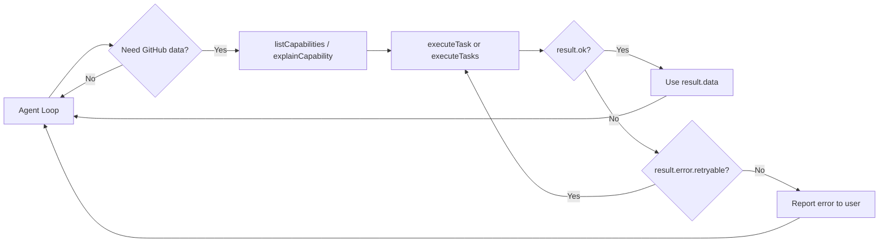

# Agent Setup

Wire ghx into your AI agent to give it deterministic, token-efficient GitHub operations.

## Install

All platforms require `@ghx-dev/core` installed globally so `ghx` is available in PATH:

```bash
npm i -g @ghx-dev/core
```

Then wire it into your agent using one of the methods below.

## Claude Code (Plugin Marketplace)

The easiest path for Claude Code users. Run these commands inside a Claude Code session:

```bash
/plugin marketplace add aryeko/ghx
/plugin install ghx@ghx-dev
```

This registers the ghx marketplace and installs the plugin. Claude Code loads the skill automatically -- no manual file management needed. Verify by starting a new session and asking Claude to perform a GitHub operation.

## Cursor, Windsurf, Codex, and Other Agents

Install the ghx skill to the standard agents directory:

```bash
ghx setup --scope user --yes

# Verify
ghx setup --scope user --verify
```

This writes `SKILL.md` to `~/.agents/skills/using-ghx/SKILL.md`. Agents that follow the `~/.agents/skills/` convention will pick it up automatically.

For agents that don't read `~/.agents/skills/`, reference the skill from your agent's config:

| Platform | Config file | How to reference |
|---|---|---|
| Cursor | `.cursor/rules/*.mdc` or `.cursorrules` | Include or paste the SKILL.md content |
| Windsurf | `.windsurfrules` | Include or paste the SKILL.md content |
| Codex | `AGENTS.md` | Reference or inline the skill instructions |
| Cline | `.clinerules` | Include or paste the SKILL.md content |

You can also install project-scoped (writes to `.agents/skills/using-ghx/SKILL.md` in the current directory):

```bash
ghx setup --scope project --yes
```

## The Execute Tool Pattern

ghx provides `createExecuteTool` — a factory that wraps the execution engine into a tool shape your agent can call:

```ts
import {
  createExecuteTool,
  createGithubClientFromToken,
  executeTask,
  listCapabilities,
  explainCapability,
} from "@ghx-dev/core"

const token = process.env.GITHUB_TOKEN!
const githubClient = createGithubClientFromToken(token)

// Create the tool
const tool = createExecuteTool({
  executeTask: (request) => executeTask(request, { githubClient, githubToken: token }),
})

// Your agent can now:
// 1. Discover what's available
const capabilities = listCapabilities()

// 2. Understand a specific capability
const info = explainCapability("pr.threads.list")

// 3. Execute it
const result = await tool.execute("pr.threads.list", {
  owner: "acme",
  name: "repo",
  prNumber: 42,
})
```

## Integration Pattern

A typical agent integration looks like this:



### Key Design Points

1. **Never throws** — `executeTask` always returns a `ResultEnvelope`. Your agent doesn't need try/catch.
2. **Route-transparent** — the agent doesn't choose CLI vs GraphQL. ghx routes automatically.
3. **Schema-validated** — inputs are validated against the operation card schema before execution. Invalid input returns a `VALIDATION` error, not a crash.
4. **Retryable errors flagged** — check `result.error.retryable` to decide whether to retry.

## Security: Token Permissions

| Use case | Recommended permissions |
|---|---|
| Read-only (view, list) | `Metadata: read`, `Contents: read`, `Pull requests: read`, `Issues: read` |
| Issue management | Above + `Issues: write` |
| PR review & merge | Above + `Pull requests: write` |
| Workflow management | Above + `Actions: read/write` |
| Full agent | `repo` scope (classic PAT) or all above (fine-grained) |

> **Principle**: Start with least privilege. Grant writes only for capabilities the agent actually uses.

## Next Steps

- [Concepts: How ghx Works](../concepts/README.md) — understand the internals
- [Error Handling Guide](../guides/error-handling.md) — build resilient agent flows
- [Capabilities Reference](../reference/capabilities.md) — browse all 70+ capabilities
