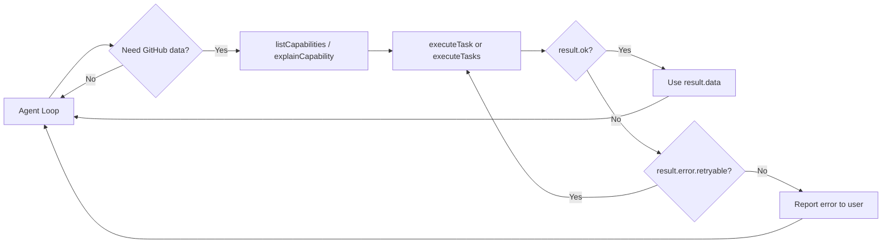

# Agent Setup

Wire ghx into your AI agent to give it deterministic, token-efficient GitHub operations.

## The Execute Tool Pattern

ghx provides `createExecuteTool` — a factory that wraps the execution engine into a tool shape your agent can call:

```ts
import {
  createExecuteTool,
  createGithubClientFromToken,
  executeTask,
  listCapabilities,
  explainCapability,
} from "@ghx-dev/core"

const token = process.env.GITHUB_TOKEN!
const githubClient = createGithubClientFromToken(token)

// Create the tool
const tool = createExecuteTool({
  executeTask: (request) => executeTask(request, { githubClient, githubToken: token }),
})

// Your agent can now:
// 1. Discover what's available
const capabilities = listCapabilities()

// 2. Understand a specific capability
const info = explainCapability("pr.threads.list")

// 3. Execute it
const result = await tool.execute("pr.threads.list", {
  owner: "acme",
  name: "repo",
  number: 42,
})
```

## Agent Skill Install (Claude Code)

ghx ships a skill file that teaches Claude Code how to use it. Install it:

```bash
# Project-scoped (recommended)
npx @ghx-dev/core setup --scope project --yes

# Verify installation
npx @ghx-dev/core setup --scope project --verify
```

This writes `SKILL.md` to `.agents/skills/ghx/SKILL.md` in your project, which Claude Code reads automatically.

## Integration Pattern

A typical agent integration looks like this:



### Key Design Points

1. **Never throws** — `executeTask` always returns a `ResultEnvelope`. Your agent doesn't need try/catch.
2. **Route-transparent** — the agent doesn't choose CLI vs GraphQL. ghx routes automatically.
3. **Schema-validated** — inputs are validated against the operation card schema before execution. Invalid input returns a `VALIDATION` error, not a crash.
4. **Retryable errors flagged** — check `result.error.retryable` to decide whether to retry.

## Security: Token Permissions

| Use case | Recommended permissions |
|---|---|
| Read-only (view, list) | `Metadata: read`, `Contents: read`, `Pull requests: read`, `Issues: read` |
| Issue management | Above + `Issues: write` |
| PR review & merge | Above + `Pull requests: write` |
| Workflow management | Above + `Actions: read/write` |
| Full agent | `repo` scope (classic PAT) or all above (fine-grained) |

> **Principle**: Start with least privilege. Grant writes only for capabilities the agent actually uses.

## Next Steps

- [Concepts: How ghx Works](../concepts/README.md) — understand the internals
- [Error Handling Guide](../guides/error-handling.md) — build resilient agent flows
- [Capabilities Reference](../reference/capabilities.md) — browse all 70 capabilities
