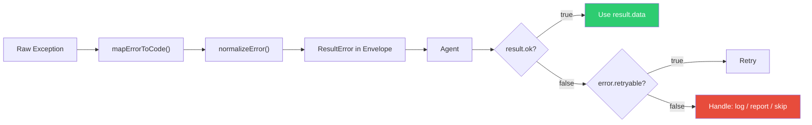

# Error Handling Guide

ghx never throws exceptions from `executeTask`. Every outcome — success, validation failure, rate limit, auth error — is returned as a `ResultEnvelope`. This guide shows you how to handle errors effectively in agent code.

## Error Flow



## Error Codes

| Code | Retryable | When it occurs |
|---|---|---|
| `AUTH` | No | Missing or invalid `GITHUB_TOKEN`, bad credentials |
| `NOT_FOUND` | No | Resource doesn't exist (issue, PR, repo) |
| `VALIDATION` | No | Input doesn't match the operation card's schema |
| `RATE_LIMIT` | **Yes** | GitHub API rate limit exceeded |
| `NETWORK` | **Yes** | Connection timeout, DNS failure |
| `SERVER` | **Yes** | GitHub 5xx error |
| `ADAPTER_UNSUPPORTED` | No | Capability doesn't support the attempted route |
| `UNKNOWN` | No | Unclassified errors |

## Patterns for Agents

### Basic: Check and Handle

```ts
const result = await executeTask(
  { task: "pr.view", input: { owner: "acme", name: "repo", number: 42 } },
  deps,
)

if (result.ok) {
  // Use result.data — typed, validated
  console.log(result.data.title)
} else {
  // result.error is always present when ok === false
  console.error(`[${result.error.code}] ${result.error.message}`)
}
```

### Retry on Retryable Errors

> **Note**: ghx already retries internally (up to 2 attempts per route, with fallback). An outer retry is for cases where the agent wants additional resilience.

```ts
async function withRetry(request: TaskRequest, deps: ExecutionDeps, maxRetries = 2) {
  for (let attempt = 0; attempt <= maxRetries; attempt++) {
    const result = await executeTask(request, deps)
    if (result.ok || !result.error.retryable) return result
    await new Promise((r) => setTimeout(r, 1000 * (attempt + 1))) // backoff
  }
  return executeTask(request, deps) // final attempt
}
```

### Error-Specific Handling

```ts
const result = await executeTask(req, deps)
if (!result.ok) {
  switch (result.error.code) {
    case "AUTH":
      throw new Error("GitHub token is missing or invalid")
    case "NOT_FOUND":
      console.warn(`Resource not found: ${req.task}`)
      return null  // graceful skip
    case "RATE_LIMIT":
      await sleep(60_000)  // wait and retry
      return executeTask(req, deps)
    case "VALIDATION":
      console.error("Invalid input:", result.error.details)
      return null
    default:
      console.error(`Unexpected error: ${result.error.message}`)
  }
}
```

### Chain Error Handling

```ts
const chain = await executeTasks(steps, deps)

if (chain.status === "success") {
  // All steps succeeded
} else if (chain.status === "partial") {
  // Some failed — inspect individual results
  for (const step of chain.results) {
    if (!step.ok) console.warn(`Step ${step.task} failed: ${step.error?.code}`)
  }
} else {
  // All failed
  console.error("Chain fully failed")
}
```

## Debugging with Attempt History

When a request fails, `result.meta.attempts` shows every route that was tried:

```ts
if (!result.ok) {
  for (const attempt of result.meta.attempts ?? []) {
    console.log(`Route ${attempt.route}: ${attempt.status} (${attempt.duration_ms}ms)`)
    if (attempt.error_code) console.log(`  Error: ${attempt.error_code}`)
  }
}
```

## Next Steps

- [Error Codes Reference](../reference/error-codes.md) — complete reference table
- [Result Envelope](../concepts/result-envelope.md) — full envelope contract
- [Telemetry](./telemetry.md) — debugging with structured logs
